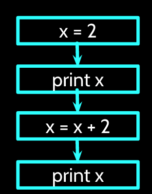

# Introduction to Python

#### About Python Language  

Remember that you are intelligent, and you can learn, but the computer is simple and very fast, but can not learn by itself. Therefore, for you to communicate instructions on the computer, it is easier for you to learn a computer Language (e.g. Python) than for the computer to learn English.

Python can be **easy to pick up and friendly to learn**. [Python](https://www.python.org/) is a **general-purpose** interpreted , interactive, object-oriented, and high-level programming language. It was created by Guido van Rossum during 1985- 1990. There are two main python versions: 2.7 and 3. For this course, we will use 2.7 since it is the most common or popular used.    

#### Basic Practise

Let's get familiar with Python by playing in the terminal in the interactive mode (you type a line at a time, and the interpreter responds). You invoke the interpreter and brings up the following prompt:

``` python
$python
Python 2.7.9 (default, Sep 17 2016, 20:26:04)
[GCC 4.9.2] on linux2
Type "help", "copyright", "credits" or "license" for more information.
>>>
```

Strings, integers, and floating points:
``` python
>>> print "Hello, Python!"
>>> x = 1         # Integer assignment
>>> y = 1005.00   # Floating points
>>> name = "John" # A string
>>> print x
>>> print y
>>> print name
```
In Python, the [standard order of operations](https://en.wikibooks.org/wiki/Python_Programming/Basic_Math) are evaluated from left to right following order (memorised by many as PEMDAS):


| Name        | Syntax     | Description  |
| ------------- |:-------------:| :-----|
| **P**arentheses     | ( ... ) | Happening before operating on anything else.|
| **E**xponents     | **  |  An exponent is a simply short multiplication or division, it should be evaluated before them. |
| **M**ultiplication and **D**ivision | * / |  Multiplication is rapid addition and must happen first. |
| **A**ddition and **S**ubtraction | + -  |     |

_Note_: // is the floor division in which the digits after the decimal point are removed. But if one of the operands is negative, the result is floored, i.e., rounded away from zero.
``` python
>>> 3/4 * 5  # First division and then Multiplication
>>> 3.0 / 4 * 5
>>> (3.0 / 4) * 4
>>> 2**8
>>> -11.0//3
>>> 11.0//3 # Result floored (rounded away from zero)
>>> -11.0/3  
>>> z = float(5)
>>> z
>>> z = int(5.25)
>>> z
>>> 10%7 # Remainder of a division
>>> 'abc' + 'fgb' # strings
```
Comparison operators:


| Name        | Syntax     |
| :-------------: |:-------------|
| < | Less than|
| > | Greater than|
| <=|	Less than or equal to|
|>=	|Greater than or equal to|
|==	|Equal to|
|!=	|Not equal to|

``` python
>>> 2 == 3  
False
# We got a boolean
>>> 3 == 3
True
>>> 2 < 3
True
>>> "a" < "aa"
True
```
##### Data Types

The data stored in memory can be of different types; Python has five: __Numbers, Strings, List, Tuple, and Dictionary__.

``` python
>>> type(x) # numbers
>>> type(y)
>>> type(name) # String
```
__Strings__ in Python are a set of characters represented by the quotation marks. Python allows for either pair of single or double quotes.

Subsets of strings can be taken using the slice operator ([] and [:] ) with indexes starting at 0 at the beginning of the string and working their way from -1 to the end.

The plus (+) sign is the string concatenation operator, and the asterisk (\*) is the repetition operator. For example:

``` python
>>> string = 'Hello World!'
>>> print string          # Prints complete string
>>> print string[0]       # Prints first character of the string
>>> print string[2:5]     # Prints characters starting from 3rd to 5th
>>> print string[2:]      # Prints string starting from 3rd character
>>> print string * 2      # Prints string two times
>>> print string + "TEST" # Prints concatenated string
```

__Lists__ are the most versatile data types in Python. A list contains items separated by commas and enclosed in square brackets ([])—similar to arrays in C. One difference between them is that all the items belonging to a list can be of different data type.

The values stored in a list can be accessed using the slice operator ([] and [:]) with indexes starting at 0 at the beginning of the list and working their way to ending -1. The plus (+) sign is the list concatenation operator, and the asterisk (\*) is the repetition operator.

``` python
>>> list = [ 'abcd', 786 , 2.23, 'john', 70.2 ]
>>> tinylist = [123, 'john']

>>> print list          # Prints complete list
>>> print list[0]       # Prints first element of the list
>>> print list[1:3]     # Prints elements starting from 2nd till 3rd
>>> print list[2:]      # Prints elements starting from 3rd element
>>> print tinylist * 2  # Prints list two times
>>> print list + tinylist # Prints concatenated lists
```

A __tuple__ is another sequence data type that is similar to the list. It consists of some values separated by commas. Unlike lists, however, tuples are enclosed within parentheses.

The main differences between lists and tuples are: Lists are enclosed in brackets ( [] ), and their elements and size can be changed, while tuples are enclosed in parentheses ( ( ) ) and cannot be updated—__immutable__. Tuples can be thought of as read-only lists.

``` python
>>> tuple = ( 'abcd', 786 , 2.23, 'john', 70.2  )
tinytuple = (123, 'john')

>>> print tuple           # Prints complete list
>>> print tuple[0]        # Prints first element of the list
>>> print tuple[1:3]      # Prints elements starting from 2nd till 3rd
>>> print tuple[2:]       # Prints elements starting from 3rd element
>>> print tinytuple * 2   # Prints list two times
>>> print tuple + tinytuple # Prints concatenated lists
```
Invalid operations on a tuple but valid on a list:

```python
>>> tuple = ( 'abcd', 786 , 2.23, 'john', 70.2  )
>>> list = [ 'abcd', 786 , 2.23, 'john', 70.2  ]
>>> tuple[2] = 1000    # Invalid syntax with tuple
>>> list[2] = 1000     # Valid syntax with list
```

Python's __dictionaries__ are hash table type. They work like associative arrays and consist of key-value pairs. A dictionary key can be almost any Python type but are usually numbers or strings. Values, on the other hand, can be any arbitrary Python object.
Dictionaries are enclosed by curly braces ({}), and values can be assigned and accessed using square braces ([]).


``` python
>>> dict = {}
>>> dict['one'] = "This is one"
>>> dict[2]     = "This is two"
# keys are: name, code and dept; values are: john, 6734 and sales
>>> tinydict = {'name': 'john','code':6734, 'dept': 'sales'}

>>> print dict['one']       # Prints value for 'one' key
>>> print dict[2]           # Prints value for 2 key
>>> print tinydict          # Prints complete dictionary
>>> print tinydict.keys()   # Prints all the keys
>>> print tinydict.values() # Prints all the values
```

To quit the Python interpreter:

``` python
>>> quit()
```

##### Scripts

A Script is a sequence of statements (lines) into a file using a text editor and tells Python interpreter to execute the statements in the file.

* We can write a program in our script like a recipe or installation of software. At the end of the day, a program is a __sequence__ of steps to be done in order.
* Some of the steps can be __conditional__, that means that sometimes they can be skipped.
* Sometimes a step or group of steps are to be __repeated__.
* Sometimes we store a set of steps that will be used over and over again in several parts of the program (__functions__).

__Note:__ Have a look on the code [style guide](https://www.python.org/dev/peps/pep-0008/#indentation) for a good coding practise. As a fist good practise, do not name files or folders with space in between: Auful! --> example 1.py; Great! --> __example_1.py, exampleOne.py, example_one.py__

We will make a simple script:

``` bash
$ pwd
$ /home/pi
$ mkdir codes/python_examples
$ cd codes/python_examples
$ nano example_fllow.py
```
Then you can type in the editor:

```python
#!/usr/bin/env python
x = 2
print x
x = x + 2
print x
```

When a program is running, it flows from one step to the next.  As programmers, we set up “paths” for the program to follow.

<p align="center">

</p>

Close the text editor, and then you can execute it in two ways:

``` bash
$ python example_fllow.py
```

The other is to give the script the access permissions to be an executable file through the [chomod](https://en.wikipedia.org/wiki/Chmod) Linux command:   

``` bash
$ chmod u+x example_fllow.py
$ ./example_fllow.py
```

Now let's do an example where we have a __conditional__ that implies a decision-making about a situation. Decision making is the anticipation of conditions occurring while execution of the program and specifying actions taken according to the conditions. The following diagram illustrates the conditional:

<p align="center">

</p>

``` bash
$ nano example_conditional.py
```
Now let's add the code:

```python
#!/usr/bin/env python
x = 5
if x < 10:
    print 'Smaller'
elif x > 20:
    print 'Bigger'          
print 'Finis' #outside conditional
```

``` bash
$ chmod u+x example_conditional.py
$ ./example_conditional.py
```

Flow of the code:

<p align="center">

</p>

A __loop statement__ allows us to execute a statement or group of statements multiple times. The following diagram illustrates a loop statement:

<p align="center">

</p>

__While loop__ repeats a statement or group of statements while a given condition is _TRUE_. It tests the condition before executing the loop body.

Now let's add the code to our script called _example_while_loop.py_:

```python
#!/usr/bin/env python
n = 5
while n > 0:
    print n
    n = n - 1
print 'Blastoff!' #outside loop
```

Before running, remember to give the permissions:

``` bash
$ chmod u+x example_while_loop.py
$ ./example_while_loop.py
```

Flow of the code:

<p align="center">

</p>

Loops (repeated steps) ha‰ve _iteration variables_ that change each time through a loop (like _n_).  Often these _iteration variables_ go through a sequence of numbers.

__For loop__ executes a sequence of statements multiple times and abbreviates the code that manages the loop variable.

Now let's add the code to our script called _example_for_loop.py_:

```python
#!/usr/bin/env python

# Area of a circle = pi * r**2

# Library
import numpy as np

# List are called interables
list = [1, 2, 3, 4, 5, 6]

for radius in list:
    area = np.pi * radius ** 2
    print "The area of a circle of radius ", radius
    print "cm is", area, "cm^2"
print "Finished to calculate the areas of circles"
```
``` bash
$ chmod u+x example_for_loop.py
$ ./example_for_loop.py
```
Here we are importing the [Numpy library](http://www.numpy.org/).
That is the fundamental package for scientific computing with Python. We are adding a short alias to the library to call its methods, in this case, the value of Pi.

##### Functions

A function is a block of organised, reusable code that is used to perform a single, related action. Functions provide better modularity for your application and a high degree of code reusing.

Now, let's make a function that can be used in the for loop example.

``` bash
$ nano example_function_circle_area.py
```
```python
#!/usr/bin/env python

# Area of a circle = pi * r**2

# Library Numpy
import numpy as np


def area_circle(radius):
    'Function that calculates the area of a circle'
    area = np.pi * radius ** 2
    return area

# List are called interables
list = [1, 2, 3, 4, 5, 6]

for radius in list:
    area = area_circle(radius)
    print "The area of a circle of radius ", radius
    print "cm is", area, "cm^2"
print "Finished to calculate the areas of circles"
```

``` bash
$ chmod u+x example_function_circle_area.py
$./example_function_circle_area.py
```

We can see that we get the same result but it is more organise and we can use the function in other section of our code.

Now let's ask the user to provide a list:

``` bash
$ nano example_function_circle_area_user_1.py
```
```python
# Area of a circle = pi * r**2

# Library Numpy
import numpy as np
# Library to Safely evaluate an expression node
# or a string containing a Python expression
import ast

# List are called interables
list_raw = raw_input('Provide a list of radius in cm like \
[3, 2, 12, 6]: \n')
list = ast.literal_eval(list_raw)


def area_circle(radius):
    'Function that calculates the area of a circle'
    area = np.pi * radius ** 2
    return area


for radius in list:
    area = area_circle(radius)
    print "The area of a circle of radius ", radius
    print "cm is", area, "cm^2"
print "Finished to calculate the areas of circles"
```
``` bash
$ chmod u+x example_function_circle_area_user_1.py
$./example_function_circle_area_user_1.py
```

If we do not use the [ast library](https://docs.python.org/2/library/ast.html) to evaluate a string containing a Python expression (in this case a list), we will get an error since Python will interpret as a string type and not a list type.

A second way to do it is by using the [sys module](https://docs.python.org/2/library/sys.html) which provides access to some variables used or maintained by the interpreter and to functions that interact strongly with the interpreter.

Now let's ask the user to provide a list by passing the strings directly:

``` bash
$ nano example_function_circle_area_user_2.py
```
``` python
#!/usr/bin/env python

# Usage instructions:
# ./example_function_circle_area_user_2.py "[1, 2, 3]"

# Area of a circle = pi * r**2

# Library Numpy
import numpy as np
# Library to Safely evaluate an expression node
# or a string containing a Python expression
import ast
# Module provides access to some variables
# used or maintained by the interpreter
import sys


list_raw = sys.argv[1]
list = ast.literal_eval(list_raw)


def area_circle(radius):
    'Function that calculates the area of a circle'
    area = np.pi * radius ** 2
    return area


for radius in list:
    area = area_circle(radius)
    print "The area of a circle of radius ", radius
    print "cm is", area, "cm^2"
print "Finished to calculate the areas of circles"
```

``` bash
$ chmod u+x example_function_circle_area_user_1.py
$./example_function_circle_area_user_2.py "[1, 2, 3]"
```


References [ [1](https://www.tutorialspoint.com/python/), Charles Severance course: Python for everybody]
