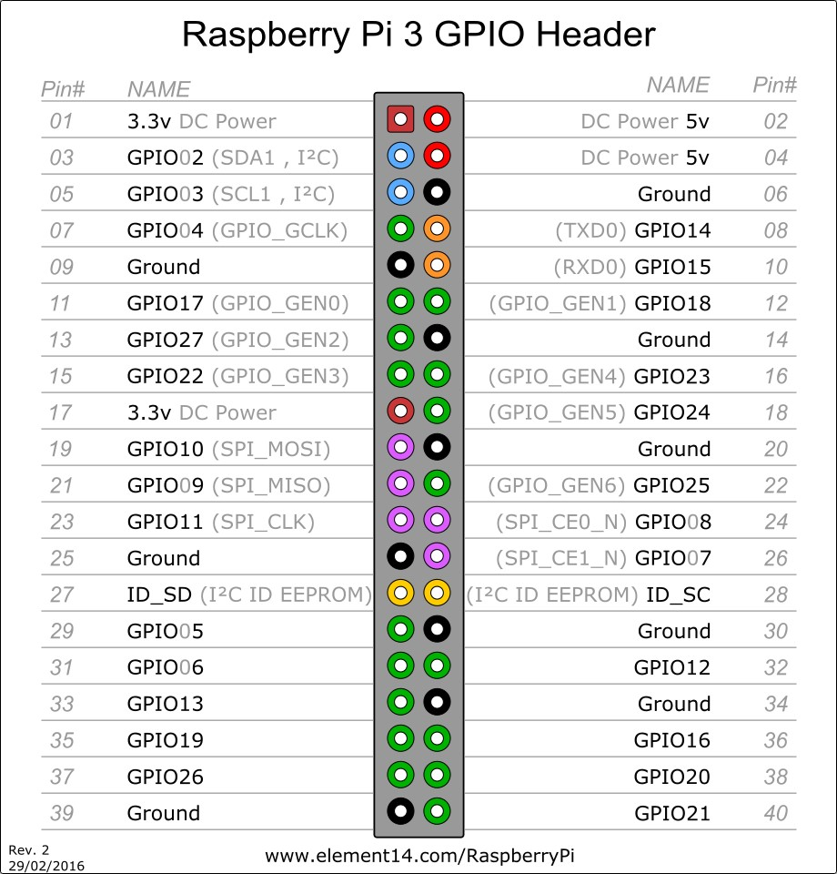

# Raspberry Pi GPIOzero

Your Raspberry Pi is more than just a small computer, it is a hardware prototyping tool! The RPi has **bi-directional I/O pins**, which you can use to drive LEDs, spin motors, or read button presses. To drive the RPi's I/O lines requires a bit or programming. You can use a [variety of programing languages](http://elinux.org/RPi_GPIO_Code_Samples), but we decided to use a really solid, easy tools for driving I/O: **Python**.

## Materials needed
[//]: # (TODO: review materials list, especially resistors)
* Raspberry Pi 3 B
* [Breadboard](https://www.sparkfun.com/products/12002?_ga=1.251311686.1915117394.1476705504)
* [Jumper Wires(M/F)](https://www.sparkfun.com/products/12794)
* [Momentary Pushbutton Switch](https://www.sparkfun.com/products/9190?_ga=1.213562324.1915117394.1476705504)
* [2 Resistors](https://www.sparkfun.com/products/11507?_ga=1.213562324.1915117394.1476705504)
* [2 LEDs](https://www.sparkfun.com/products/9590?_ga=1.213548756.1915117394.1476705504)

##  GPIO Pinout

Raspberry has its GPIO over a standard male header on the board. From the first models to the latest, the header has expanded from 26 pins to 40 pins while maintaining the original pinout.

<p align="center">

</p>

There are (at least) two, different numbering schemes you may encounter when referencing **Pi pin numbers**:

1. **Broadcom (SoC) chip-specific** pin numbers.
2. **P1 physical** pin numbers.

You can use either number-system, but when you are programming how to use the pins, it requires that you declare which scheme you are using at the very beginning of your program. We will see this later.

The next table shows all 40 pins on the P1 header, including any particular function they may have, and their dual numbers:

<p align="center">

</p>

In the next table, we show another numbering system along with the ones we showed above: **Pi pin header numbers and element14 given names, wiringPi numbers, Python numbers, and related silkscreen on the wedge**. The Broadcom pin numbers in the table are related to RPi Model 2 and later only.

<p align="center">

</p>

This table shows that the RPi not only gives you access to the bi-directional I/O pins, but also [Serial (UART)](https://learn.sparkfun.com/tutorials/serial-communication), [I2C](https://learn.sparkfun.com/tutorials/i2c), [SPI](https://learn.sparkfun.com/tutorials/serial-peripheral-interface-spi), and even some Pulse width modulation ([PWM](https://learn.sparkfun.com/tutorials/pulse-width-modulation) — “analog output”).


### Analog vs. Digital

Before starting with our practise, we will revise the difference between **analog** and **digital** signals. Both are used to transmit information, usually through **electric signals**. In both these technologies, the information, such as any audio or video, is transformed into electric signals. The **difference between analog and digital**:

* In **analog technology**, information is translated into electric pulses of varying amplitude.

* In **digital technology**, translation of information is into binary format (zero or one) where each bit is representative of two distinct amplitudes.


#### Comparison chart

||Analog	|Digital|
|:------|:-------|:-------|
|**Signal**| Analog signal is a continuous signal which represents physical measurements.|	Digital signals are discrete time signals generated by digital modulation.|
|**Waves**|	Denoted by sine waves.|	Denoted by square waves.|
|**Representation**| Uses continuous range of values to represent information.|	Uses discrete or discontinuous values to represent information.|
|**Example**|	Human voice in air, analog electronic devices.|	Computers, CDs, DVDs, and other digital electronic devices.|
|**Technology**| Analog technology records waveforms as they are.|	Samples analog waveforms into a limited set of numbers and records them.|
|**Data transmissions**|Subjected to deterioration by noise during transmission and write/read cycle.|Can be noise-immune without deterioration during transmission and write/read cycle.|
|**Response to Noise**|	More likely to get affected reducing accuracy|	Less affected since noise response are analog in nature|
|**Flexibility**|	Analog hardware is not flexible.|Digital hardware is flexible in implementation.|
|**Uses**|Can be used in analog devices only. Best suited for audio and video transmission.|	Best suited for Computing and digital electronics.|
|**Applications**|Thermometer|PCs, PDAs|
|**Bandwidth**|	Analog signal processing can be done in real time and consumes less bandwidth.|	There is no guarantee that digital signal processing can be done in real time and consumes more bandwidth to carry out the same information.|
|**Memory**| Stored in the form of wave signal.|Stored in the form of binary bit.|
|**Power**|	Analog instrument draws large power.|	Digital instrument drawS only negligible power.|
|**Cost**|Low cost and portable.|	Cost is high and not easily portable.|
|**Impedance**|	Low	|High order of 100 megaohm|
|**Errors**|Analog instruments usually have a scale which is cramped at lower end and give considerable observational errors.|	Digital instruments are free from observational errors like parallax and approximation errors.|

## Blink
We will start with a very easy example, the classic "Blink" example, later we will do the same with our Arduino and see the differences.

###### Hardware Setup
We start assembling the circuit as shown in the diagram below.


###### Code
For the code we are going to use the [GPIOzero](https://gpiozero.readthedocs.io/en/stable/) library which is a  on the GPIO library (https://sourceforge.net/p/raspberry-gpio-python/wiki/Home/)
1. From your laptop's terminal connect to the RPi
2. Create a folder called "code" and inside it a file called "blinker.py":
```
$ mkdir code
$ cd code
$ nano blinker.py
```
3. Copy and paste this code:
```
#!/usr/bin/env python

from gpiozero import LED
from time import sleep

led = LED(17)

while True:
    led.on()
    sleep(1)
    led.off()
    sleep(1)

```

4. Save and exit

5. Run this script with the command:
```
sudo python ./blinker.py
```
6. To stop the script from running press CTRL+C

7. To make the script an executable run:
```
$ sudo chmod u+x blinker.py
```
Now you can execute it with just this command:
```
$ ./blinker.py
```
8. Yay! The LED is blinking!

### Python (RPi.GPIO) API: Overview of the basic function calls used in our example.
##### Setup Section
When we use python to control our GPIO pins, we always need to import the corresponding Python module, which goes at the top of the script:
```
import gpiozero as gpio
```

In here, we are giving a shorter name to the module “GPIOzero”, in order to call the module through our script. This line is fundamental for every script requiring GPIO functions. If you want to import only certain classes from GPIOzero you could also use:
```
from gpiozero import LED
```
If, for example, you are interested in using the class LED solely. Or
```
from gpiozero import LED, Button
```
If you just want to use the Button and LED class.


It is important to define which of the two pin-numbering schemes you want to use:
GPIO.BOARD– Board numbering scheme. The pin numbers follow the pin numbers on header P1.
GPIO.BCM – Broadcom chip-specific pin numbers. These pin numbers follow the lower-level numbering system defined by the Raspberry Pi’s Broadcom-chip brain.
To specify in your code which number-system is being used, use the GPIO.setmode() function as:

GPIO.setmode(GPIO.BCM)
This will activate the Broadcom-chip specific pin numbers.

Setting a Pin Mode
You have to declare a “pin mode” before you can use it as either an input or output. To set a pin mode, use the setup([pin], [GPIO.IN, GPIO.OUT] function. So, if you want to set pin 18 (in the BCM) or 12 (in the BOARD) as an output, for example:

GPIO.setup(18, GPIO.OUT)
Output
Digital Output

To write a pin high or low, use the GPIO.output([pin], [GPIO.LOW, GPIO.HIGH]) function. For example, if you want to set pin 18 (in the BCM) high:

GPIO.output(18, GPIO.HIGH)
Writing a pin to GPIO.HIGH will drive it to 3.3V, and GPIO.LOW will set it to 0V. For the lazy, alternative to GPIO.HIGH and GPIO.LOW, you can use either 1, True, 0 or False to set a pin value.

Pulse-width Modulation (PWM-“Analog”) Output

To initialize PWM, use GPIO.PWM([pin], [frequency]) function. To make the rest of your script-writing easier you can assign that instance to a variable. Then use pwm.start([duty cycle]) function to set an initial value. For example, we can set PWM pin up with a frequency of 1kHz, and set that output to a 50% duty cycle:

pwm = GPIO.PWM(18, 1000)
pwm.start(50)
To adjust the value of the PWM output, use the pwm.ChangeDutyCycle([duty cycle]) function. [duty cycle] can be any value between 0 (i.e 0%/LOW) and 100 (ie.e 100%/HIGH). So to set a pin to 75% on, for example, you could write:

pwm.ChangeDutyCycle(75)
To turn PWM on that pin off, use the pwm.stop() command. Just don’t forget to set the pin as an output before you use it for PWM.

Inputs
If a pin is configured as an input, you can use the GPIO.input([pin]) function to read its value. The input() function will return either a True or False indicating whether the pin is HIGH or LOW. You can use an if statement to test this. For example, in the next lines of code the GPIO library will read pin 17 (in the BCM) and print whether it is being read as HIGH or LOW:

if GPIO.input(17):
    print("Pin 11 is HIGH")
else:
    print("Pin 11 is LOW")
Pull-Up/Down Resistors

In the the GPIO.setup() function, we saw above, where we declared whether a pin was an input or output, we can use a third parameter to set pull-up or pull-down resistors: pull_up_down=GPIO.PUD_UP or pull_up_down=GPIO.PUD_DOWN. For example, to use a pull-up resistor on GPIO 17 (in the BCM), write this into your setup:

GPIO.setup(17, GPIO.IN, pull_up_down=GPIO.PUD_UP)
If nothing is declared in that third value, both pull-resistors will be disabled.

Others
Setting up delays

If you need to slow down your Python script, you can add delays by incorporating the time module at the top of your script as:

import time
Then, you can use time.sleep([seconds]) to give your script a rest. You can use decimals to precisely set your delay. For example, to delay 250 milliseconds, write:

time.sleep(0.25)
Garbage Collecting
Once your script has run its course, be kind to the next process that might use your GPIOs by cleaning up after yourself. Use the GPIO.cleanup() command at the end of your script to release any resources your script may be using. Your RPi will survive if you forget to add this command, but it is good practice to include wherever you can.

Suggested readings
Pulse-Width Modulation – You can use PWM to dim LEDs or send signals to servo motors. The RPi has a single PWM-capable pin.
Light-Emitting Diodes (LEDs) – To test the output capabilities of the Pi we will use some Leds.
Switch Basics – To test inputs to the Pi, we will use buttons and switches.
Pull-Up Resistors – The Pi has internal pull-up (and pull-down) resistors. These are very handy when you are interfacing buttons with the little computer.
