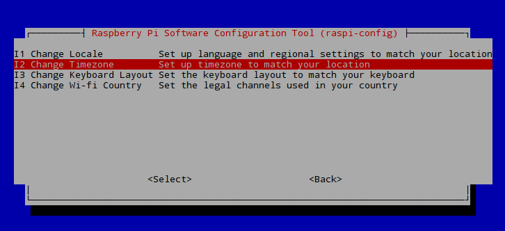
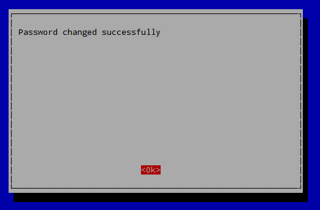

# Setting up your Raspberry Pi 3 Model B

The goal of this first session is to set up our Raspberry Pis, so they can run "headless". This means that we will be able to control the RPi remotely from our laptops, without the need to connect the RPi to a screen, keyboard and mouse each time we use it. This initial setup, therefore, reduces the time we spend in setting up our Rpi each time we use it and minimizes the cabling, this, will be fundamental when our Pi will be inserted in our Pixel.

We will use the [SSH](https://en.wikipedia.org/wiki/Secure_Shell) protocol to connect from our laptop to the RPi over the Imperial/eduroam WiFi network. It let us establish a secure network communication on an unsecured network. To achieve this we will rely on remot3.it services as we will later explain.

To setup our RPi we will use the terminal. If you are new to the terminal can be a bit overwhelming at first, don't panic and follow the steps carefully!
We have created a [cheat sheet](../Introductory_Material/Cheat_sheet_bash_Linux.md) to help you out.

## Hardware Setup for Raspberry Pi

At first we will setup the RPi using peripherals. Each team should get the following equipment:

  * 1 Touchscreen
  * 1 Raspberry to touchscreen HDMI-HDMI plug
  * 1 Touchscreen pen
  * 1 Raspberry Pi Power Supply
  * 1 Raspberry Pi
  * 1 Keyboard
  * 1 SD Card
  * 1 Wooden plate
  * 8 M2.5 Bolts
  * 4 M2.5 Standoffs
  * 3 M3 Bolts
  * 4 M3 Spacers
  * 4 M3 Nuts
  * 1 Breadboard
  * 1 Arduino
  * 1 USB A to USB B Cable
  * 1 Screwdriver
  * 1 Pair of Pliers


1. Attach the Raspberry Pi to the wooden plate, first bolt the 4 M2.5 Standoffs to the plate and then attach the RPi to the plate with 4 more bolts (don't tighten them too much):


2. Repeat the same operation with the Arduino using the M3 spacers, nuts and bolts. You will be able only to secure it with three bolts, remember not to tighten them too much:


3. To attach the breadboard to the wooden plate, peel off the back of it to expose the adhesive strip and glue it to the wooden plate:


4. Insert the micro-SD card in the back of the RPi, like so:


5. Connect the touchscreen to the RPi, connecting it to the pins and with the HDMI plug, like so:


6. Connect the keyboard with the USB.


7. Using the power cable, power up the RPi and the screen:


8. The RPi will start the setup, if the screen doesn't illuminate check that it is on.

**Note:** The SD we have provided has [NOOBS](https://www.raspberrypi.org/downloads/noobs/) with the [Raspbian OS](https://www.raspberrypi.org/downloads/raspbian/) already installed. We have also added the drivers for the touchscreen. [Here](https://www.waveshare.com/wiki/5inch_HDMI_LCD) you can find additional steps to modify the configuration of the touchscreen.

## System setup for Raspberry Pi

Now we will start running some commands in the terminal.  We will run them as a **root user**, the root has the permission to modify files or default settings as administrator. By default on Raspbian (the operating system of our RPIs) the **root user** is **pi** and the **root password** associated to the root user is **raspberry**.
To operate as a root user in the terminal every command is preceded by the ```sudo``` command.

1. Type the following command and press 'Enter' to open the configuration menu of the RPi:

``` bash
$ sudo raspi-config
```

The terminal will show a menu. The options can be navigated with the vertical keys of your keyboard, to accept the options press 'Enter', to finish press the lateral keys of the keyboard.


2. First we set up the keyboard to prevent any problem when we will change the root password. We access the option: __4 Localisation Options__:


Then __Change Keyboard Layout__:


Then we choose __Generic 105 key__:


And then __English (UK)__:


Then we can choose the default options that the menu is prompting by pressing enter:


3. Then we are re-directed to the main menu, now we change the timezone from the __4 Localisation Options__ menu.


Then we choose __Change Timezone__:



Then __Europe__:


Then __London__:


4. Now we will change the root user password. This increases the security of the connection we will establish from our laptop to the RPi. Since you are sharing this RPi with your teammates choose a password together. To change the password we are re-directed to the main menu and here we choose the first option: __1 Change User Password__:


Then we agree to change the password:


Type the new password twice:




We have set the new password. Do not reboot the RPi yet.

5. Lastly we will check that the SSH is enabled. We need to enable it to connect with the RPi remotely. From the main menu we access: __5 Interfacing Options__:


Then we select __SSH__:


Then we confirm that we want to enable the SSH server:


We confirm again:


6. Exit the menu by pressing the right arrow twice to select __Finish__ and enter. You will re-enter the terminal.

## Setting up the WiFi from Imperial College network with a guest account

In the classroom you will be given a guest username (i.e *guest000000*, 'guest' followed by a sequence of 6 digits) and a guest password (8 characters long, alphanumeric). We are going to modify a modify a configuration file called  *wpa_supplicant.conf*.

**Note:** The guest account is valid for 90 days only. So you should change the setting with your personal college credentials. The steps are similar to the following ones and we have prepared a tutorial [here](../SupplementaryMaterial/AlternativeNetworkSettings.md). It also includes setup for the **eduroam** network.

1. First we back up the configuration file *wpa_supplicant.conf*, to do so we enter the command:
```
  $ sudo cp /etc/wpa_supplicant/wpa_supplicant.conf /etc/wpa_supplicant/wpa_supplicant.conf_backup
```

 2. Then we edit the *wpa_supplicant.conf*. The default text editor installed in the RPi is _nano_. To edit a file with the nano editor is sufficient to enter the command ```nano /path/to/file```. Therefore to edit *wpa_supplicant.conf* we enter the following command with admin user permission:
 ```bash
 $ sudo nano /etc/wpa_supplicant/wpa_supplicant.conf
 ```

 This file should just have the next line at the beginning:
 ```bash
 ctrl_interface=DIR=/var/run/wpa_supplicant GROUP=netdev
 update_config=1
 ```

 3. Then we add to the content of *wpa_supplicant.conf* the lines after # IC (**the configuration is case sensitive, so make sure you do not have typos**):

 ```bash
 ctrl_interface=DIR=/var/run/wpa_supplicant GROUP=netdev
 update_config=1


 # IC
 network={
          ssid="Imperial-WPA"
          proto=RSN
          key_mgmt=WPA-EAP
          pairwise=CCMP
          auth_alg=OPEN
          eap=PEAP
          identity="ic\guest000000"
          password="YOUR_PASSWORD"
 }
 ```

 Where *guest000000* has to be replaced with the actual guest account and YOUR_PASSWORD with the password associated to it.

 5. Now we can check if the connection works by rebooting your RPi. Reboot it by entering:
 ``` bash
 $ reboot
 ```
 One the system starts again the RPi should connect automatically to the WiFi.


 ### Step 2: Encrypting Your Password

 1. In order not to store the password in a plain text we substitute our password with an **encrypted** one using  a **MD4 hash generator**. You can generate the hash with the following Linux command:

 ```bash
 $ echo -n 'YOUR_PASSWORD' | iconv -t utf16le | openssl md4
 ```

 You will have to substitute 'YOUR_PASSWORD' with the password related to the account in the *wpa_supplicant.conf*. This will be the only time you'll have to type it in plain text. Ask your teammates to look away from the screen if you are not comfortable in them seeing your password.

 2. The previous command will display the encrypted password on your terminal like this:
 ```bash
 $ (stdin)= a6c71eedc2eacbca84003336a4a62a1c
 ```
 We copy the string that was generated in your terminal screen (i.e. 'a6c71eedc2eacbca84003336a4a62a1c' in the example).

 **Note:** Also you can save the hash from your password in a file and then read its content:
 ```bash
 $ echo -n 'YOUR_PASSWORD' | iconv -t utf16le | openssl md4 > hash.txt
 $ cat hash.txt
 ```
 The first command creates the encrypted password and stores it in the __hash.txt__ file.
 The second command reads the content of the __hash.txt__ file.
 In general we use the `cat` command to read and concatenate files.

 3. Then we open again the *wpa_supplicant.conf* with:

 ```bash
 $ sudo nano /etc/wpa_supplicant/wpa_supplicant.conf
 ```
 4. In the password field replace "YOUR_PASSWORD" with the string you generated as hexadecimal characters, adding the 'hash:' prefix as shown in the example bellow:

 ```bash
 # IC
 network={
         ssid="Imperial-WPA"
         proto=RSN
         key_mgmt=WPA-EAP
         pairwise=CCMP
         auth_alg=OPEN
         eap=PEAP
         identity="guest000000"
         password=hash:a6c71eedc2eacbca84003336a4a62a1c
 }
 ```
 5. The last security step to perform is to remove the bash history (the one that stores all the commands we had typed on the terminal). Therefore, we enter the following commands:
 ```bash
 $ history -w
 $ history -c
 ```
 6. Then we reboot the RPi to check that the password was properly set up with:
 ```bash
 $ reboot
 ```
 7. And you are done!


## Installing Python

To install Linux packages in our RPi system we use the command: ```sudo apt-get install name_of_package``` in the terminal. Each installation could take some minutes.

1. Updating operative system
```bash
sudo apt-get update
```
2. Installing C lib needed by Python
```bash
sudo apt-get -y install libffi-dev
sudo apt-get -y install libssl-dev
```
3. Installing Pythons
```bash
sudo apt-get -y install build-essential python-dev python-openssl
sudo apt-get -y install python-setuptools
sudo apt-get -y remove --purge python-pip
sudo apt-get -y install python-pip
sudo pip install --upgrade pip
```

We suggest that after this lesson you back up the image of your RPi at home to have a copy af this . In order to do so we have prepared a [guide](/SupplementaryMaterial/BackingUpRPi/BackingUpRPi.md).


#### [Next Step](../Chapter_5/Remote_Rpi.md)
