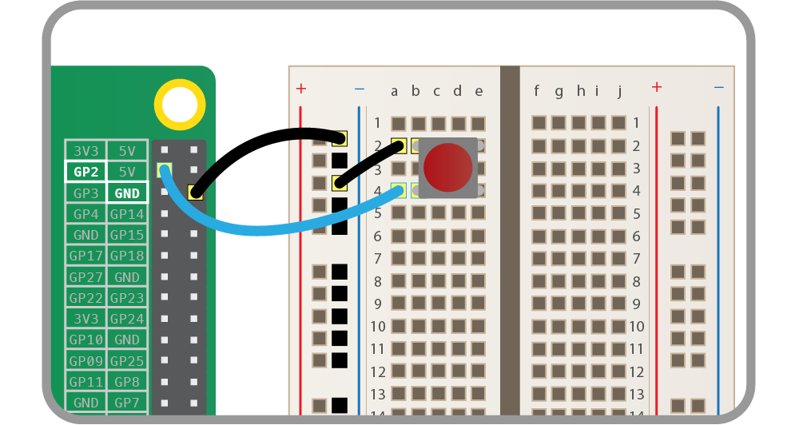

# Raspberry Pi GPIOzero

1. [Materials needed](#materials_needed)
2. [GPIO pinout](#gpio_pinout)
3. [Analog vs. Digital](#analog_vs._digital)
4. [Blink](#blink)
5. [LED PWM](#led_pwm)
6. [Button](#button)
7. [Combining everything](#combining_everything)

Your Raspberry Pi is more than just a small computer, it is a hardware prototyping tool! The RPi has **bi-directional I/O pins**, which you can use to drive LEDs, spin motors, or read button presses. To drive the RPi's I/O lines requires a bit or programming. You can use a [variety of programing languages](http://elinux.org/RPi_GPIO_Code_Samples), but we decided to use a really solid, easy tools for driving I/O: **Python**.

### Materials needed

* Raspberry Pi 3 B
* [Breadboard](https://www.sparkfun.com/products/12002?_ga=1.251311686.1915117394.1476705504)
* [Jumper Wires(M/F)](https://www.sparkfun.com/products/12794)
* [Momentary Pushbutton Switch](https://www.sparkfun.com/products/9190?_ga=1.213562324.1915117394.1476705504)
* [2 10KΩ Resistors](https://www.sparkfun.com/products/11507?_ga=1.213562324.1915117394.1476705504)
* [2 LEDs](https://www.sparkfun.com/products/9590?_ga=1.213548756.1915117394.1476705504)

###  GPIO Pinout

Raspberry has its GPIO over a standard male header on the board. From the first models to the latest, the header has expanded from 26 pins to 40 pins while maintaining the original pinout.

<p align="center">

</p>

There are (at least) two, different numbering schemes you may encounter when referencing **Pi pin numbers**:

1. **Broadcom (SoC) chip-specific** pin numbers.
2. **P1 physical** pin numbers.

You can use either number-system, but when you are programming how to use the pins, it requires that you declare which scheme you are using at the very beginning of your program. We will see this later.

The next table shows all 40 pins on the P1 header, including any particular function they may have, and their dual numbers:

<p align="center">

</p>

In the next table, we show another numbering system along with the ones we showed above: **Pi pin header numbers and element14 given names, wiringPi numbers, Python numbers, and related silkscreen on the wedge**. The Broadcom pin numbers in the table are related to RPi Model 2 and later only.

<p align="center">

</p>

This table shows that the RPi not only gives you access to the bi-directional I/O pins, but also [Serial (UART)](https://learn.sparkfun.com/tutorials/serial-communication), [I2C](https://learn.sparkfun.com/tutorials/i2c), [SPI](https://learn.sparkfun.com/tutorials/serial-peripheral-interface-spi), and even some Pulse width modulation ([PWM](https://learn.sparkfun.com/tutorials/pulse-width-modulation) — “analog output”).


##### Analog vs. Digital

Before starting with our practise, we will revise the difference between **analog** and **digital** signals. Both are used to transmit information, usually through **electric signals**. In both these technologies, the information, such as any audio or video, is transformed into electric signals. The **difference between analog and digital**:

* In **analog technology**, information is translated into electric pulses of varying amplitude.

* In **digital technology**, translation of information is into binary format (zero or one) where each bit is representative of two distinct amplitudes.


##### Comparison chart

||Analog	|Digital|
|:------|:-------|:-------|
|**Signal**| Analog signal is a continuous signal which represents physical measurements.|	Digital signals are discrete time signals generated by digital modulation.|
|**Waves**|	Denoted by sine waves.|	Denoted by square waves.|
|**Representation**| Uses continuous range of values to represent information.|	Uses discrete or discontinuous values to represent information.|
|**Example**|	Human voice in air, analog electronic devices.|	Computers, CDs, DVDs, and other digital electronic devices.|
|**Technology**| Analog technology records waveforms as they are.|	Samples analog waveforms into a limited set of numbers and records them.|
|**Data transmissions**|Subjected to deterioration by noise during transmission and write/read cycle.|Can be noise-immune without deterioration during transmission and write/read cycle.|
|**Response to Noise**|	More likely to get affected reducing accuracy|	Less affected since noise response are analog in nature|
|**Flexibility**|	Analog hardware is not flexible.|Digital hardware is flexible in implementation.|
|**Uses**|Can be used in analog devices only. Best suited for audio and video transmission.|	Best suited for Computing and digital electronics.|
|**Applications**|Thermometer|PCs, PDAs|
|**Bandwidth**|	Analog signal processing can be done in real time and consumes less bandwidth.|	There is no guarantee that digital signal processing can be done in real time and consumes more bandwidth to carry out the same information.|
|**Memory**| Stored in the form of wave signal.|Stored in the form of binary bit.|
|**Power**|	Analog instrument draws large power.|	Digital instrument drawS only negligible power.|
|**Cost**|Low cost and portable.|	Cost is high and not easily portable.|
|**Impedance**|	Low	|High order of 100 megaohm|
|**Errors**|Analog instruments usually have a scale which is cramped at lower end and give considerable observational errors.|	Digital instruments are free from observational errors like parallax and approximation errors.|

### Blink
We will start with a very easy example, the classic "Blink" example, later we will do the same with our Arduino and see the differences.

##### Hardware Setup
We start assembling the circuit as shown in the diagram below.


##### Code
For the code we are going to use the [GPIOzero](https://gpiozero.readthedocs.io/en/stable/) library which is a  on the GPIO library (https://sourceforge.net/p/raspberry-gpio-python/wiki/Home/)
1. From your laptop's terminal connect to the RPi
2. Create a folder called "code" and inside it a file called "blinker.py":
```
$ mkdir code
$ cd code
$ nano blinker.py
```
3. Copy and paste this code:
```
#!/usr/bin/env python

from gpiozero import LED
from time import sleep

led = LED(17)

while True:
    led.on()
    sleep(1)
    led.off()
    sleep(1)

```

4. Save and exit

5. Run this script with the command:
```
sudo python ./blinker.py
```
6. To stop the script from running press CTRL+C

7. To make the script an executable run:
```
$ sudo chmod u+x blinker.py
```
Now you can execute it with just this command:
```
$ ./blinker.py
```
8. Yay! The LED is blinking!

##### Understanding the "Blink" example

```
#!/usr/bin/env python
```
This line is used to tell which interpreter (in our case Python) to use when the file is made into an executable.


When we use Python to control our GPIO pins, we always need to import the corresponding Python module, which goes at the top of the script:
```
import gpiozero as gpio
```
Here, we are giving a shorter name to the module “GPIOzero”, in order to call the module through our script. This line is fundamental for every script requiring GPIO functions. If you want to import only certain classes from GPIOzero you could also use:
```
from gpiozero import LED
```
If, for example, you are interested in using the class LED solely. Or
```
from gpiozero import LED, Button
```
If want to use the Button and LED class.


```
from time import sleep
```
Here we are just importing the function sleep from the [time library](https://www.tutorialspoint.com/python/time_sleep.htm), we will later use it to make the LED blink.


```
led = LED(17)
```
Here we are creating a variable called `led` and we are initialising it with an object of the class [LED](https://gpiozero.readthedocs.io/en/stable/api_output.html#led). On object of the class LED to be initialised takes as a parameter the pin number to which the LED is connected to, in our case the pin number is 17.
**Note:** GPIOzero uses ONLY Broadcom (BCM) pin numbering and it is not configurable, so when referring to pins in one of your scripts always use this numbering:


```
while True:
```
Here we are are basically asking to Python to loop forever. In fact the `while` statements loops through its code until the initial condition becomes false, in our case never.


```
led.on()
sleep(1)
led.off()
sleep(1)
```
Here we are using two methods of the class [LED](https://gpiozero.readthedocs.io/en/stable/api_output.html#led) pf GPIOzero. `on()` switches the device on and `off` turns it off. We are calling the two functions with a 1 second interval, in fact the function `sleep` suspends execution for the given number of seconds.

### LED PWM
Use the same layout for the electronics as before.

##### What is PWM?
Pulse Width Modulation, or PWM, is a technique for getting analog results with digital means. Digital control is used to create a square wave, a signal switched between on and off. This on-off pattern can simulate voltages in between full on (3.3 Volts for RPi and 5 Volts for Arduino) and off (0 Volts) by changing the portion of the time the signal spends on versus the time that the signal spends off. The duration of "on time" is called the pulse width. To get varying analog values, you change, or modulate, that pulse width. If you repeat this on-off pattern fast enough with an LED for example, the result is as if the signal is a steady voltage between 0 and 5v controlling the brightness of the LED.

For more information check out [this link](https://learn.sparkfun.com/tutorials/pulse-width-modulation)

##### Code
Repeat the same steps of "Blink" to upload the code below, this time call the file *led-pwm.py* and save it in the *code* folder that we have previously created. It's up to you to make the code executable or not.
```
#!/usr/bin/env python

from gpiozero import PWMLED
from time import sleep

led = PWMLED(17)

while True:
    led.value = 0  # off
    sleep(1)
    led.value = 0.5  # half brightness
    sleep(1)
    led.value = 1  # full brightness
    sleep(1)
```

##### Understanding "LED PWM" code

The main difference here is that we are using the [class PWMLED](https://gpiozero.readthedocs.io/en/stable/api_output.html#gpiozero.PWMLED) instead of the class LED. The PWMLED class has an extra parameter that we can tweak which is `value`. `value` indicates the duty cycle of this PWM device. 0.0 is off, 1.0 is fully on. Values in between may be specified for varying levels of power in the device.

### Button

##### Hardware Setup
We start assembling the circuit as shown in the diagram below.



##### Code
Repeat the same steps of "Blink" to upload the code below, this time call the file *button.py* and save it in the *code* folder that we have previously created. It's up to you to make the code executable or not.
```
#!/usr/bin/env python

from gpiozero import Button

button = Button(2)

while True:
    if button.is_pressed:
        print("Button is pressed")
    else:
        print("Button is not pressed")
```

##### Understanding "Button" code
Here we are using the [class Button](https://gpiozero.readthedocs.io/en/stable/api_input.html#button) from GPIOzero.
This class has many functions and parameter, so make sure you check out the reference. Here we are using the `is_pressed` property of the class. `is_pressed` returns True if the device is currently active and False otherwise.

### Combining Everything

Now we challenge you to combine all the previous three scripts to create one. Make the script in order that
* when the button is pressed one of the two leds fades to 25% of its brightness and the other one blinks once
* when the button is released the pwmled goes back to 100% brightness.

##### Hardware Setup
We start assembling the circuit as shown in the diagram below.


##### Code Tips
Use the `when_pressed` and `when_released` properties of the [Button class](https://gpiozero.readthedocs.io/en/stable/api_input.html#button)
[Here](https://gpiozero.readthedocs.io/en/stable/recipes.html#button-controlled-led) you can find the code to control one LED with the button.

<small>Based on the GPIOzero library [notes](https://gpiozero.readthedocs.io/en/stable/index.html) and [this reference](http://www.diffen.com/difference/Analog_vs_Digital) and [this intro](https://learn.sparkfun.com/tutorials/raspberry-gpio) </small>
