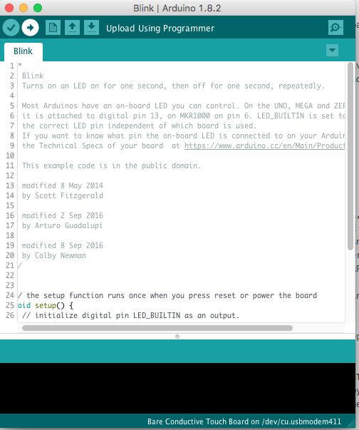

### Running our first Arduino sketch

We are going to run the "blink" sketch we have seen early on in this tutorial. It is the most basic sketch a sort of "Hello World!" for Arduino. It makes the built-in LED on pin 13 blink in intervals of 1 second.

1. Connect the Arduino to your laptop with the USB cable

2. Open the IDE
[//]: # (TODO: add photo)

3. Click **Tools->Serial Port** and select the USB serial port to which your Arduino is connected to (the path changes with operating system and USB port you are using, so the name might be different for you).
[//]: # (TODO: add photo)

4. Then, select the right board: click **Tools->Board->Arduino Uno**.
[//]: # (TODO: add photo)

5. Then you can open the basic sketch "Blink" by clicking on **File->Example->01. Basics-> Blink**.
[//]: # (TODO: add photo)

6. You can then upload the sketch on the Arduino by clicking the "Upload" button (the one with an arrow).

7. Once uploaded you will see the LED on pin 13 blink.
[//]: # (TODO: add GIF)
