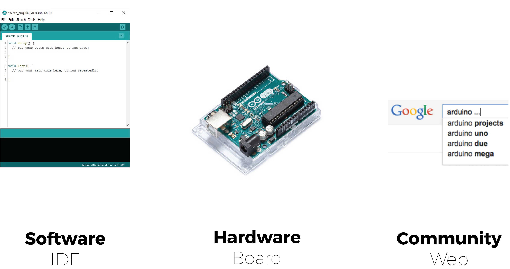
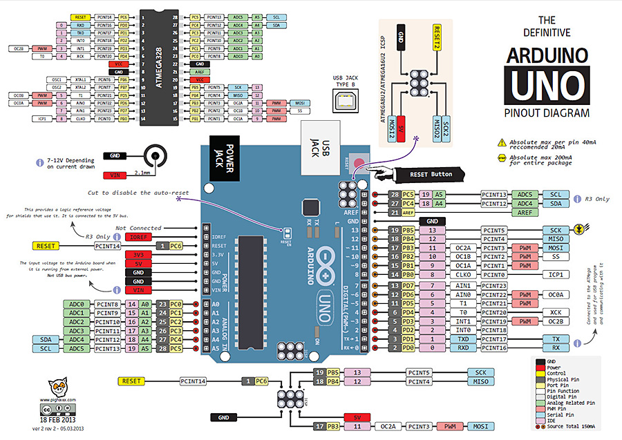
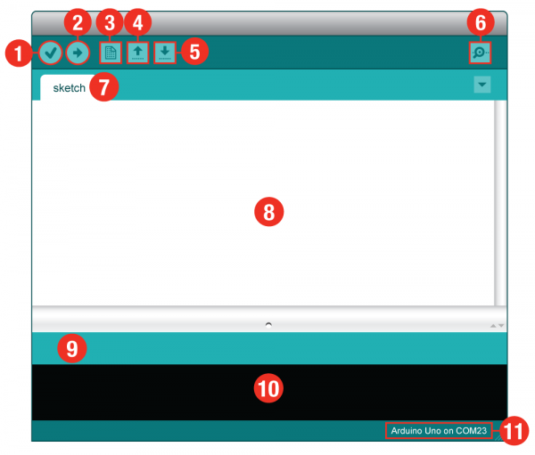
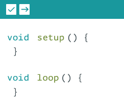
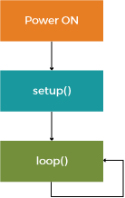
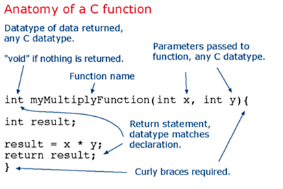

# What is Arduino?

1. [Arduino UNO Board Structure](#physical_structure_of_an_arduino_uno_board)
2. [Configuring the pins on Arduino](#configuring_the_pins_on_arduino)
3. [Quick tour of the Arduino IDE](#quick_tour_of_the_arduino_ide)
4. [Anatomy of an Arduino Sketch](#anatomy_of_an_arduino_sketch)
5. [Arduino Language and Syntax](#arduino_language)



### What is Arduino: Hardware
An Arduino is essentially a microcontroller. That is a small "computer" (SoC - System on a Chip) on a single integrated
circuit containing a processor core, memory and programmable input/output peripherals (a.k.a. sensors and actuators).

#### Physical structure of an Arduino UNO board


1. Digital pins Use these pins with digitalRead(), digitalWrite(), and analogWrite(). analogWrite() works only on the pins with the PWM symbol.
2. Pin 13 LED The only actuator built-in to your board. Besides being a handy target for your first blink sketch, this LED is very useful for debugging.
3. Power LED Indicates that your Arduino is receiving power. Useful for debugging.
4. ATmega microcontroller The heart of your board.
5. Analog in Use these pins with analogRead().
6. GND and 5V pins Use these pins to provide +5V power and ground to your circuits.
7. Power connector This is how you power your Arduino when it’s not plugged into a USB port for power. Can accept voltages between 7-12V.
8. TX and RX LEDs These LEDs indicate communication between your Arduino and your computer. Expect them to flicker rapidly during sketch upload as well as during serial communication. Useful for debugging.
9. USB port Used for powering your Arduino Uno, uploading your sketches to your Arduino, and for communicating with your Arduino sketch (via Serial. println() etc.).
10. Reset button Resets the ATmega microcontroller.

Here's a scheme of it's pin's functionalities:



### Configuring the pins on Arduino

##### Digital Pins (GPIO)

All the pins on the Arduino are programmable. They can be configured as either inputs or outputs using the ```pinMode()``` function.
They can be controlled with two functions:
  + ```digitalRead()```: reads the value of the pin
  + ```digitalWrite()```: sets the output of the pin to either HIGH (1, drives the pin to 5V) or LOW (0, drives the pin to 0V)
We will see in detail how to control them later on.

###### Pins Configured as INPUT

Arduino (Atmega) pins default to inputs, so they don't need to be explicitly declared as inputs with pinMode() when you're using them as inputs. Pins configured this way are said to be in a high-impedance state. Input pins make extremely small demands on the circuit that they are sampling. This means that it takes very little current to move the input pin from one state to another, and can make the pins useful for such tasks as implementing a capacitive touch sensor, reading an LED as a photodiode, or reading an analog sensor with a scheme such as RCTime.

This also means however, that pins configured as pinMode(pin, INPUT) with nothing connected to them, or with wires connected to them that are not connected to other circuits, will report seemingly random changes in pin state, picking up electrical noise from the environment, or capacitively coupling the state of a nearby pin.

###### Pins Configured as INPUT with Pullup/Pulldown Resistors

Often it is useful to steer an input pin to a known state if no input is present. In doing so you cancel the random values of the pin when nothing is connected to it. This can be done by adding a pullup resistor (to +5V), or a pulldown resistor (resistor to ground) on the input. A 10K resistor is a good value for a pullup or pulldown resistor.

**Note:** On the Arduino there are built-in pullup resistors that can be activate via code setting pinMode() as INPUT_PULLUP. This effectively inverts the behavior of the INPUT mode, where HIGH means the sensor is off, and LOW means the sensor is on.

When connecting a sensor to a pin configured with INPUT_PULLUP, the other end should be connected to ground. In the case of a simple switch, this causes the pin to read HIGH when the switch is open, and LOW when the switch is pressed.

You can find more information about pullup/pulldown resistors [here](https://playground.arduino.cc/CommonTopics/PullUpDownResistor).

###### Pins configured as OUTPUT

Pins configured as OUTPUT with pinMode() are said to be in a low-impedance state. This means that they can provide a substantial amount of current to other circuits. Atmega pins can source (provide positive current) or sink (provide negative current) up to 40 mA (milliamps) of current to other devices/circuits. This is enough current to brightly light up an LED (don't forget the series resistor), or run many sensors, for example, but not enough current to run most relays, solenoids, or motors.

Short circuits on Arduino pins, or attempting to run high current devices from them, can damage or destroy the output transistors in the pin, or damage the entire Atmega chip. Often this will result in a "dead" pin in the microcontroller but the remaining chip will still function adequately. For this reason it is a good idea to connect OUTPUT pins to other devices with 470Ω or 1k resistors, unless maximum current draw from the pins is required for a particular application.

##### Analog Pins

The Atmega controllers used for the Arduino contain an onboard 6 channel analog-to-digital (A/D) converter, that correspond to the analog pins (A0-A5). The converter has 10 bit resolution, returning integers from 0 to 1023.  This means that when we want to read the pin's value it maps input voltages between 0 and 5 volts into integer values between 0 and 1023.  
The analog pins can be controlled with two functions:
+ ```analogRead()```: reads the value of the pin
+ ```analogWrite()```: sets the output value of the pin

While the main function of the analog pins for most Arduino users is to read analog sensors, the analog pins also have all the functionality of general purpose input/output (GPIO) pins (the same as digital pins 0 - 13). Therefor they can used as digital pins with the digital functions.

The Atmega datasheet also cautions against switching analog pins in close temporal proximity to making A/D readings (analogRead) on other analog pins. This can cause electrical noise and introduce jitter in the analog system. It may be desirable, after manipulating analog pins (in digital mode), to add a short delay before using analogRead() to read other analog pins.

#### PWM

In the graphic below, the green lines represent a regular time period. This duration or period is the inverse of the PWM frequency. In other words, with Arduino's PWM frequency at about 500Hz, the green lines would measure 2 milliseconds each. A call to analogWrite() is on a scale of 0 - 255, such that analogWrite(255) requests a 100% duty cycle (always on), and analogWrite(127) is a 50% duty cycle (on half the time) for example.


**Note:** For more informations you can check the Arduino [Microcontroller section](https://www.arduino.cc/en/Tutorial/Foundations) of their Foundations.

### What is Arduino: Software
Please download the Arduino IDE from [Arduino's website](https://www.arduino.cc/en/Main/Software) if you are having any trouble there are setup guides for every operating system on [his page](https://www.arduino.cc/en/Guide/HomePage).

#### Quick tour of the Arduino IDE

Arduino has it's own integrated development environment that simplifies some of the operations. The IDE manages library, offers a built-in compiler and has a lot of examples and references.

Here is a screnshot of how the IDE looks like and all its functionalities:



1. Verify: Compiles and approves your code. It will catch
errors in syntax (like missing semi-colons or parenthesis).
2. Upload: Sends your code to the Uno. When you click it, you
should see the lights on your board blink rapidly.
3. New: This buttons opens up a new code window tab.
4. Open: This button will let you open up an existing sketch.
5. Save: This saves the currently active sketch.
6. Serial Monitor: This will open a window that displays any
serial information your Uno Board is transmitting. It is very
useful for debugging.
7. Sketch Name: This shows the name of the sketch you are
currently working on.
8. Code Area: This is the area where you compose the code
for your sketch.
9. Message Area: This is where the IDE tells you if there were
any errors in your code.
10. Text Console: The text console shows complete error
messages. When debugging, the text console is very useful.
11. Board and Serial Port: Shows you what board and the
serial port selections

#### Anatomy of an Arduino Sketch




Each Arduino program is called a "sketch". Each Sketch has two main function ```setup()``` and ```loop()```:
  + ```setup()``` is called when a sketch starts. Use it to initialize variables, pin modes, start using libraries, etc. The setup function will only run once, after each powerup or reset of the Arduino board.
  + ```loop()``` is called after ```setup()```, and it loops consecutively, allowing your program to change and respond. Use it to actively control the Arduino board.

Here's an example of what an Arduino sketch looks like:
```
/*
  Blink
  Turns on an LED on for one second, then off for one second, repeatedly.

  This example code is in the public domain.
 */

// Pin 13 has an LED connected.
// give it a name:
int pin = 13;

// the setup routine runs once when you press reset:
void setup() {                
  // initialize the digital pin as an output.
  pinMode(pin, OUTPUT);     
}

// the loop routine runs over and over again forever:
void loop() {
  digitalWrite(pin, HIGH);   // turn the LED on (HIGH is the voltage level)
  delay(1000);               // wait for a second
  digitalWrite(pin, LOW);    // turn the LED off by making the voltage LOW
  delay(1000);               // wait for a second
}
```

#### Arduino Language

The programming language used in Arduino comes from C++ and it is quite different from Python. Although the names of the functions are self explanatory as they are written in plain English.

The most visible difference is that you have to terminate each line with a semicolon (`;`) to end a statement, if you forget one the compiler will warn you about it.

###### Variables

The fundamental difference from Python is that Arduino doesn't use dynamic typing. Therefore when we create a variable we have to declare its type:

`int pin = 13;`  

We have just created a variable whose type is **int**, whose name is **pin**, whose **value** is 13.
Later on in the program, you can refer to this variable by its name, at which point its value will be looked up and used. For example, in this statement:

`pinMode(pin, OUTPUT);`  

We are setting the pin 13 as an OUTPUT pin, what we have written would be equivalent to `pinMode(13, OUTPUT);`.
You can change the value of a variable using an assignment (indicated by an equals sign). For example:

`pin = 12;`  

will change the value of the variable to 12. Notice that we don't specify the type of the variable: it's not changed by the assignment. That is, the name of the variable is permanently associated with a type; only its value changes.

When you assign one variable to another, you're making a copy of its value and storing that copy in the location in memory associated with the other variable. Changing one has no effect on the other. For example, after:

```
int pin = 13;
int pin2 = pin;
pin = 12;
```

only pin has the value 12; pin2 is still 13.

Arduino has many types. Too name a few: int, float, string, boolean, char, ... To learn more about the specificities about each type we invite you to look at the [Arduino Reference Page](https://www.arduino.cc/en/Reference/HomePage)

#### Further Arduino Syntax

We have collected useful examples of Arduino syntax for some major functions you are familiar with in Python.

###### If
```
if (pinFiveInput < 500){
    // action A
} else {
    // action B
}
```

###### While
```
while(expression){
  // statement(s)
}
```

###### For
```
for (int i=0; i <= 255; i++){
      analogWrite(PWMpin, i);
      delay(10);
}
```
That can be translated in pseudocode as:
```
for (initialization; condition; increment) {
    //statement(s);
}
```

###### Comments
For inline comments you can use `//` for multiple-lines comments instead use `/*` at the beginning and `*/` at the end.
```
//this is an inline comment  
```
```
/*this is a comment  
on multiple lines*/
```

###### Comparison Operators
+ `x == y (x is equal to y)`
+ `x != y (x is not equal to y)`
+ `x <  y (x is less than y)`
+ `x >  y (x is greater than y)`
+ `x <= y (x is less than or equal to y)`
+ `x >= y (x is greater than or equal to y)`

###### Arithmetic Operations
* = (assignment operator)
* +  (addition)
* - (subtraction)
* * (multiplication)
* / (division)
* % (modulo)

###### Boolean Operations
* && (and)
* || (or)
* ! (not)

###### Functions
Segmenting code into functions allows a programmer to create modular pieces of code that perform a defined task and then return to the area of code from which the function was "called". The typical case for creating a function is when one needs to perform the same action multiple times in a program.
Standardising code fragments into functions has several advantages:

- Functions help the programmer stay organised. Often this helps to conceptualise the program.
- Functions codify one action in one place so that the function only has to be thought out and debugged once.
- This also reduces chances for errors in modification, if the code needs to be changed.
- Functions make the whole sketch smaller and more compact because sections of code are reused many times.
- They make it easier to reuse code in other programs by making it more modular, and as a nice side effect, using functions also often makes the code more readable.
There are two required functions in an Arduino sketch, setup() and loop(). Other functions must be created outside the brackets of those two functions. As an example, we will create a simple function to multiply two numbers.



Our function needs to be declared outside any other function, so "myMultiplyFunction()" can go either above or below the "loop()" function.

```
void setup(){
  Serial.begin(9600);
}

void loop() {
  int i = 2;
  int j = 3;
  int k;

  k = myMultiplyFunction(i, j); // k now contains 6
  Serial.println(k);
  delay(500);
}

int myMultiplyFunction(int x, int y){
  int result;
  result = x * y;
  return result;
}
```
**Another Example**
This function will read a sensor five times with analogRead() and calculate the average of five readings. It then scales the data to 8 bits (0-255), and inverts it, returning the inverted result.
```
int ReadSens_and_Condition(){
  int i;
  int sval = 0;

  for (i = 0; i < 5; i++){
    sval = sval + analogRead(0);    // sensor on analog pin 0
  }

  sval = sval / 5;    // average
  sval = sval / 4;    // scale to 8 bits (0 - 255)
  sval = 255 - sval;  // invert output
  return sval;
}
```

To call our function we just assign it to a variable, the following code should be placed inside `loop`.
```
int sens;
sens = ReadSens_and_Condition();
```

For further reference about the syntax and language you can check these notes:
https://www.arduino.cc/en/Tutorial/Variables
https://www.arduino.cc/en/Reference/HomePage
