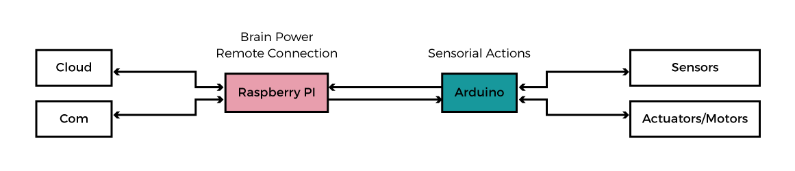
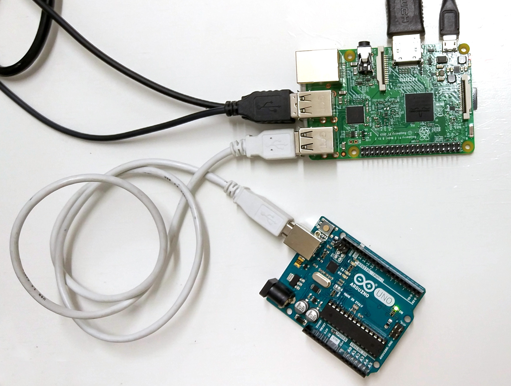
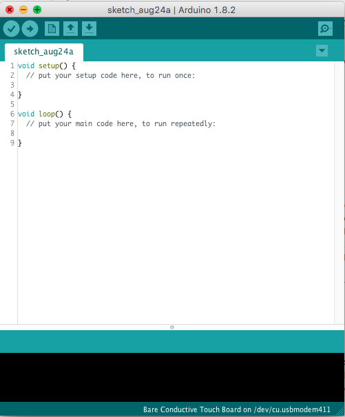
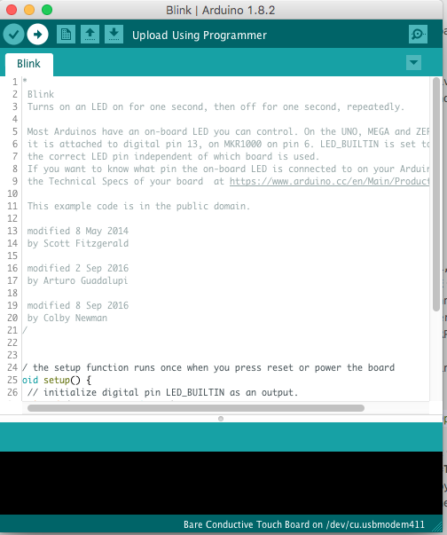
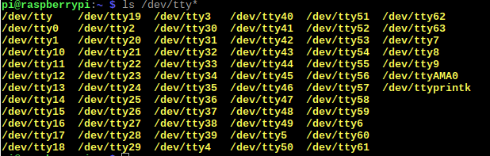
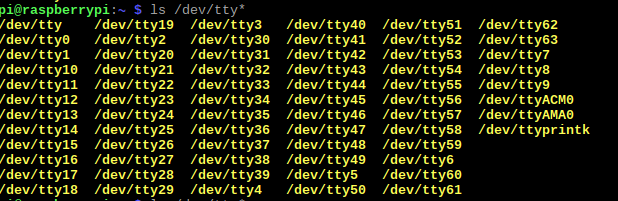
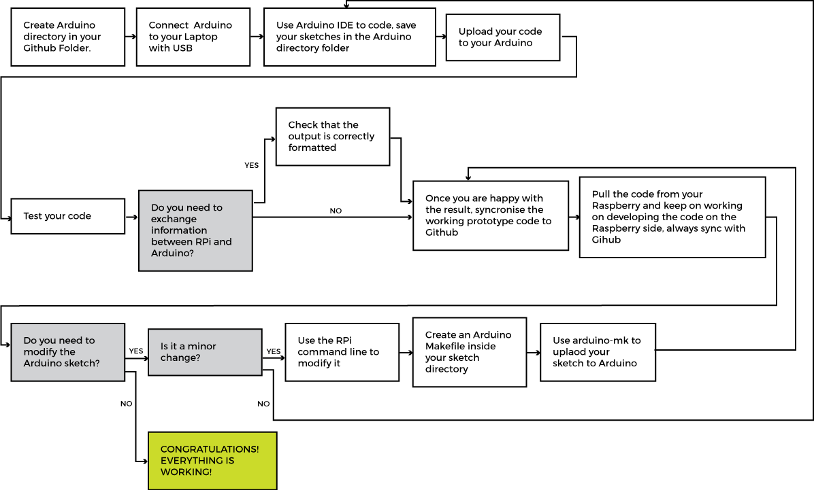

# Setting up Arduino for the Raspberry Pi

In this tutorial we will see how to connect your Raspberry Pi to your Arduino. We will start by installing the Arduino IDE that you have already seen and then move to some command line tools. These tools don't need a graphical interface and you can use them without a monitor. The last section will give you some advices on how to install these tools on your laptop.

You have to think of the Raspberry Pi as a computer that offers computational power and network capabilities, whereas Arduino communicates with sensors and actuators:


1. [Arduino IDE](#arduino-ide)
2. [Arduino Makefile](#arduino-makefile)
3. [Arduino and Raspberry Pi Talking Over Serial](#arduino-and-raspberry-pi-talking-over-serial)
4. [Suggested workflow](#suggested-workflow)
5. [Other tools to make Arduino and Raspberry communicate](#other-tools-to-make-arduino-and-raspberry-communicate)
6. [Command Line tools for your computer](#command-line-tools-for-your-computer)

## Arduino IDE

In this section we will se how to install the Arduino IDE from the command line of your RPi. This installation will be useful as it installs libraries that are used by the command line tools.

### Installing Arduino on the Raspberry
From the terminal of your computer connected to the RPi via ssh type:
```bash
sudo apt-get install arduino
```
It is going to ask you to agree on using additional disk space, type Y and press Enter.

Once we have done this installation we need to grant ourselves the permission to use the serial port. In order to do so we are going to add our user (pi) to the _tty_ and _dialout_ groups with two commands:
```bash
sudo usermod -a -G tty pi
```
```bash
sudo usermod -a -G dialout pi
```

#### Working with the Arduino IDE

If you now connect a keyboard, mouse and screen to your RPi, you can see that in the RPi menu under the "Electronics" section, Arduino IDE has been installed.  You can go ahead and use the Arduino IDE as you would on your laptop. The only difference is that the RPI is a slower to compile the new lines of code from the RPi with respect to a laptop.
To test if Arduino IDE is working you can connect the Arduino to the RPi using one of the available USB ports like so:



Then run the Arduino IDE.



Click **Tools->Serial Port** and select the USB serial port to which your Arduino is connected (usually /dev/ttyACM0). Then, click **Tools->Board->Arduino Uno**. Then you can open the basic sketch "Blink" by clicking on **File->Example->01. Basics-> Blink**. You can then upload the sketch on the Arduino by clicking the "Upload" button (the one with an arrow).



Once uploaded you will see the LED on pin 13 blink.

**Note:** If /dev/ttyACM0 doesn't work, you can find out in which serial port your Arduino is plugged by unplugging it from the RPi. Then on the Rpi terminal type:

```bash
ls /dev/tty*
```

This command lists all the connected devices, it should show "/dev/ttyAMA0". Then plug in your Arduino again and enter the same command and you should find the right port popping up.





## Arduino Makefile

Now we are going to see how to write Arduino programs and compile and upload them to an Arduino from the command-line, avoiding the Arduino IDE. This will be very useful when we have finalized our electronics and we want to tweak some values without changing the whole I/O setup by rewiring the Arduino.

First we are going to see how to do so using a [Makefile](https://en.wikipedia.org/wiki/Makefile) for Arduino with [arduino-mk](https://github.com/sudar/Arduino-Makefile) and then we are going to introduce another tool called ino.

#### Installation

1. First we are going to need to install the core Arduino development tools. We will need the ‘build-essential’ package that includes all the [GNU binutils](https://en.wikipedia.org/wiki/GNU_Binutils) including make etc... So, from the terminal of your computer connected to the RPi, type:

```bash
sudo apt-get install build-essential
```

2. Now we can install these two packages:

```bash
sudo apt-get install arduino-core arduino-mk
```
`arduino-core` provides all the Core Arduino libraries etc., and the Atmel AVR tool-chain (the libraries and tools designed for AVR microcontrollers, like Arduino).  
`arduino-mk` is a generic Makefile which conforms to the Gnu make syntax and which we can include into any Makefile we construct to build our code from the command line.

#### Creating an Arduino Sketch without the IDE

When we installed the Arduino IDE it created a directory called "sketchbook". This folder is made to store all your Arduino files tidily and to have them readily available for the IDE. We are going to use this folder even with our Makefile to maintain the compatibility with the IDE.

**Note:** Each Arduino sketch has the extension .ino, these are the "source files", the instructions to be built into an executable program. These source files to be built correctly with the IDE need to be contained in a folder that has the same name as the sketch i.e. with a directory tree as follows:
../sketchbook  
└── blink  
    └── blink.ino  

Using arduino-mk we are going to create a Makefile inside the source file directory; some other auxiliary files are going to be generated during the build process as we will see.

For this example we are going to upload the same "blink" sketch we have seen before to test the functioning of our Makefile. This time we are going to create and manipulate the file from the command line.

To set up our project we follow these steps:

1. We are going to change the directory where we are and enter the sketchbook directory with this command:
```bash
cd /home/pi/sketchbook
```
2. Then we make our directory and cd to it:
```bash
mkdir blink
cd blink
```
3. Now we are going to create the .ino fie with nano and write our sketch, so we type:
```bash
nano blink.ino
```
4. Now we want to copy/paste these lines of code (feel free to tweak the delay values to play with the blinking time):

```
#define LED_PIN 13

void setup() {
  pinMode(LED_PIN, OUTPUT);
}

void loop() {
  digitalWrite(LED_PIN, HIGH);
  delay(100); //100 millisecons ON
  digitalWrite(LED_PIN, LOW);
  delay(900); //100 millisecons OFF
}
```
We save and exit.

#### The Makefile
Now we will write a Makefile in the same directory as our .ino sketch. With   this file we can compile and ultimately upload the blink program we have just written.

1. We are still in the same "blink" directory (/home/pi/sketchbook/blink), if you have changed it simply change back with `cd`. We create another file like we did before:
```bash
nano Makefile
```
2. Now we will write our Makefile. Here is the source of the Makefile that you can copy-paste:
```
ARDUINO_DIR  = /usr/share/arduino
#ARDUINO_LIBS = Ethernet Ethernet/utility SPI
BOARD_TAG    = uno
ARDUINO_PORT = /dev/ttyACM0

include /usr/share/arduino/Arduino.mk
```
* `ARDUINO_DIR` is the directory where by default our Arduino folder has been created when we installed the Arduino package.
* `ARDUINO_LIBS` is the line that tells to the compiler which library are being used in the sketch. In "blink.ino" we are not using any library, that's why it has been commented out with the `#` character. If you are using any library in the future remember to include them and to remove the comment.
* `BOARD_TAG` specify the kind of board we are using. We will always be using the Arduino Uno.
* `ARDUINO_PORT` specify the USB Serial port to which our Arduino is connected.
* `include ..` tells the compiler to include generic Makefile we have installed with `arduino-mk`.


#### Building our Project
Now we are going to build our sketch. This means that we are going to create an executable version of our Sketch. The Makefile tells the compiler how to assemble all the instruction blocks. Moreover the compiler will translate what we have written in Arduino language into C++.

To build our file we simply enter:
```bash
make
```

You will see a warning fly past about depends.mk not existing. This file will be created on the first compile.
If this all works there will now be a sub-directory called ‘build-command line’, in which there are a whole bunch of files.

These files are inside the *build-uno* folder so we change our directory:
```bash
cd build-uno
```

Then to see al the files, even the hidden ones we can enter the command `ls -a` or `ls -ld .?*`

There are loads of files, including a lot which bear no resemblance to any source we have created. These are standard library files which have been compiled and which are linked into the result.

The files which are crucial to us now are:

+ *blink.elf*
+ *blink.hex*

**Note:** even if your source file was called differently from its containing directory, these two files will be named after the directory in which we are working. This will still work if you build your sketch with arduino-mk but not with the Arduino IDE.

The .hex file is an ASCII file which contains a dump of the operation codes written into the .elf file.
If you now use ```file blink.elf``` command to inspect blink.elf, you get this result:
```bash
blink1.elf: ELF 32-bit LSB executable, Atmel AVR 8-bit, version 1 (SYSV), statically linked, not stripped
```
As you can see, this is an Atmel 8-bit executable, not a Linux executable.
The blink.hex file is ASCII but it is the values in this file which get written into the programmable chip on the Arduino board.

#### Uploading our Project
Now we are going to upload the compiled code to the Arduino. If you have unplugged it from your Raspberry, please connect it again with the provided USB cable.
To upload the sketch simply type:
```bash
sudo make upload
```
We need to use sudo for this to get permissions to the serial device.
Now your Arduino will start blinking!!

**Note:** If it doesn't work you may have selected the wrong port. You can check to which port the Arduino is connected with the command ```ls /dev/ttyACM*``` or as we have illustrated before in the note to **Working with the Arduino IDE**.

What we have just done is ‘cross-compiled’ an executable. That is we have compiled some code on one platform, for running on another platform, or ‘flavour’ of processor.

## Arduino and Raspberry Pi Talking Over Serial

To communicate between the Raspberry Pi and the Arduino over a serial connection, we’ll use the built-in Serial library on the Arduino side, and the Python pySerial module on the Raspberry Pi side.

1. To install the serial module, run the following commands on your RPi terminal:
```bash
sudo apt-get install python-serial python3-serial
```

2. Now we want to upload a new sketch on the Arduino. You can upload it from your computer using the IDE or using Arduino-mk as we did in the previous step. The code is the following:
```
void setup() {
Serial.begin(9600);
}

void loop() {
   for(byte n=0; n<255; n++){
     Serial.write(n);
     delay(50);
   }
}
```
This code counts upward and sends each number over the serial connection.
Note that in Arduino, Serial.write() sends the actual number in the byte type, the actual 8-bit representation of the number.

3. Now plug the Arduino to the USB of the Raspberry if you have unplugged it. Then in the RPi terminal let's open the Python shell by typing:
```bash
  python
```
This will launch the Python interpreter and the `>>>` prompt should appear.

4. Now we type:
```python
from serial import Serial
```
If successful, when you press enter you should see no errors, and the cursor will return to the `>>>` prompt. Now we can use the class Serial to connect to our Arduino.

5. We create a variable of type Serial that represents the serial connection with our Arduino:
```python
serialFromArduino = Serial('/dev/ttyACM0')
```
6. We can read one bit at a time what the Arduino has written over serial like this:
```python
input = serialFromArduino.read(1)
```
7. Then we print it in the console like this:
```python
print(ord(input))
```  
`ord`, given a string of length one, returns the value of the byte when the argument is an 8-bit string.
You should see a *0* being printed.

8. Now that we have tested that the connection works we want to write a Python script that reads the messages from serial.
so we type:
```
cd home/pi/
nano serialEcho.py
```
And we paste this code:
```python
import serial
port = "/dev/ttyACM0"
serialFromArduino = serial.Serial(port, 9600)
serialFromArduino.flushInput()
while True:
 if (serialFromArduino.in_Waiting() > 0):
   input = serialFromArduino.read(1)
   print(ord(input))
```

The meaning of each line is as follows:
  * `import serial`: just like before we import the serial library
  * `port = "/dev/ttyACM0"`: this time we save the port path in a variable
  * `serialFromArduino = serial.Serial(port, 9600)`: we create an object of the class Serial, this time we specify the baud rate of our serial connection
  * `serialFromArduino.flushInput()`: we clear out the input buffer
  * `while True:`:we put the reading functions in a loop so we keep on reading the values written by the Arduino constantly
  * `if (serialFromArduino.in_Waiting() > 0):`: we check that we are receiving bytes (i.e. that the input buffer is not empty)
  * `input = serialFromArduino.read(1)`:w e read the content of the input buffer one byte at a time
  * `print(ord(input))`: we interpret the incoming byte and we print it in the console

The Arduino is sending a number to the Python script, which interprets that number as a string. The input variable will contain whatever character maps to that number in the ASCII table. To get a better idea, try replacing the last line of the Python script with this:
```
print(str(ord(input)) + " = the ASCII character " + input + ".")
```

## Suggested workflow
We have prepared a schematic workflow chart to represent the suggested usage of the tools we have just introduced and how can these be tied together with the usage of Github.



## Other tools to make Arduino and Raspberry communicate
Sometimes the communication over Serial is not the best option for your project or you might want to make your RPi and Arduino communicate in another way, or maybe communicate to other boards, so we have prepared a list of possible alternatives, but don't limit yourself to the ones listed. They are just brief introductions with links for a more in-depth knowledge. We leave this exploration to your curiosity!


#### Protocols
* [Serial over GPIO](https://oscarliang.com/raspberry-pi-and-arduino-connected-serial-gpio/) with this method you can use the same cod we have used before, the only difference is the physical connection. You will need a voltage converter to operate this method safely. Otherwise there is an other risky option which is creating your own voltage divider, however we do not recommend you to do so.
* [I2C](https://www.youtube.com/watch?v=DsSBTYbXAKg) is protocol that allows two devices to talk to each other using only two buses: a clock one (SCL bus) and a data on (SDA bus). It can allow up to 127 slaves connected to one master to exchange information. It is a very common protocol for Arduino as it is used to communicate with various sensors. There is a [dedicated library called Wire](https://www.arduino.cc/en/Reference/Wire) in Arduino that you can readily use.  
* [SPI](http://radiostud.io/understanding-spi-in-raspberry-pi/) is a synchronous serial communication interface specification used for short distance communication, primarily in embedded systems. It uses four buses: clock (SCK), two data lines (MISO: Master Output Slave Input, MOSI: Master Input Slave Output) and a select line(SS) to choose among the multiple slave devices.

#### Software
* [Ino](#ino) is a command line tool that uses makefiles as well, is a simplified version of arduino-mk, but it has a big caveat which is that it modifies the directory structure, making it not compatible for the Arduino IDE.
* [pyFirmata](https://pypi.python.org/pypi/pyFirmata) is Python interface for the Firmata procotol. It allows you to control an Arduino implementing the Firmata protocol with Python.
* [Noduino](https://sbstjn.com/noduino/) is a JavaScript and Node.js framework for accessing basic Arduino controls from web pplications using HTML5, Socket.IO and Node.js.
* [More examples here](http://www.pd-tutorial.com/english/index.html)

## Ino

Now we are going to see how to use ino, which is a tool written in Python. While it ultimately uses the same AVR tools that are used by the Arduino IDE, and by the Arduino-mk tool we used last time, it offers a different way of achieving the same results.
Where ino wins over other command line tools is that it hides the messy bits of project authoring and building from the user. It has a major drawback which is that it imposes a specific directory tree as we will see. This makes it less compatible with the IDE.

#### Installing ino

To install ino we simply enter the command:
```bash
sudo pip install ino
```
### Using ino

1. First of all we go to the sketchbook directory:
```bash
cd /home/pi/sketchbook
```
2. Once again we create a new directory for our project:
```bash
mkdir blink2
cd blink2
```
3. This time we use ino to initialize the blink project from one of the ino examples:
```bash
ino init -t blink
```

This will create two sub-directories in our project directory:
../sketchbook
└── blink2  
    ├── lib/  
    └── src/  

In the src directory there is our source file, or ‘sketch’, called:
sketch.ino

4. We enter:
```bash
cd src
cat sketch.ino
```
The terminal will show you the content of the file. As you can see it is exactly the same as the blink.ino source file we created for the blink project in the Arduino-mk section.
ino has created this file automatically for us when we initialised the project with `ino init -t blink`.
Feel free to tweak it with *nano* to change the blinking pattern.

**Note:** ino has two templates we can use: blink and empty. "empty" is a simple sketch with the setup and loop function already created. You can choose to initialise you sketch as empty by running `ino init -t blink` in a new folder.

In the lib directory there is one file, called .holder, which appears to be empty.
We are not using any libraries other than the defaults in this sketch so there will be nothing in lib. If we were using libraries the files would automatically be added here.

5. Now we build the project by typing:
```bash
ino build
```

This will create a directory called .build.
In .build there are two things now:

* environment.pickle
* uno/

The .pickle file is a Python mechanism for taking a snap-shot of the build environment at build time.
The directory uno, is where you will find similar files to the ones created before.
Note that the uno directory is only called uno because it is an Arduino Uno for which we are developing, and because it is the default board type. If we chose to use a different Arduino version, this directory would be named the same way as the board type.

Looking in the uno directory we see a bunch of files:
* arduino/
* firmware.elf*
* firmware.hex
* Makefile
* Makefile.deps
* Makefile.sketch
* src/

If you looked in arduino/, you would see files which should be familiar to you.
Now in this directory, we also see:

* firmware.elf
* firmware.hex

These two files correspond to the blink.elf and blink.hex files which were created by Arduino-mk last time.
It is these files which are used in the upload.

6. If you entered these folders go back to *blink2*. Then we issue this command to upload the sketch on our board:
```bash
sudo ino upload
```
Some of the messages that flew past will look familiar to you as they are the same of Arduino-mk.
Now your sketch is uploaded and you should see your Arduino blinking again!


## Command Line tools for your computer
If you would like to use the same tools on your computer you can do so if you have either a Mac or Linux computer. If you have a Linux computer you can follow exactly the same steps.

If you have Mac special attention to the path of the USB port. It is going to look like this */dev/tty.usbmodem411* to find your port name you can enter the command `ls /dev/tty.usb*`.
Also on Mac there is no `apt-get` command. You have to install another package manager, we recommend using [Homebrew](https://brew.sh/) and to install any package use `brew install PACKAGE_NAME`

<small>Based on [Raspberry VI Tutorial] (http://www.raspberryvi.org/stories/arduino-cli.html#)
</small>
