# Remote connection to your Raspberry Pi

**remot3.it** services allow you to connect easily and securely to your Pi from a mobile app, browser window and a terminal. It allows you to control remote computers (our RPi) using tcp hosts such as SSH. You will be able to connect to your RPi from laptop or desktop at home. The free remot3.it account allows for multiple registered services and 8 hours connections on up to 1 concurrent service(s).

1. To configure weaved in our RPi, first we need to open an account on the [remot3.it](https://www.remot3.it/web/index.html) website. You can register from your laptop or desktop. You could also use the credentials of a weaved account, if you have one already.

2. Once you have an account, from your RPi terminal we need to install weaved (which is the precursor on which remot3.it is based) to be able to connect our RPi. To install it:
```bash
sudo apt-get -y install weavedconnectd
```
3. Then we will open the weaved installer to link your RPi to your remot3.it account:
```bash
sudo weavedinstaller
```
4. Enter your remot3.it account username and password. Next, you will see this menu:

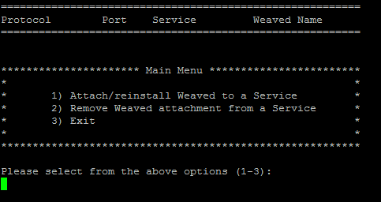

5. Then enter a name for your RPi (e.g. "myPI"). You can make it up, but remember to make a name easy for you to identify a specific RPi in case you have more than one attached to the weaved service:

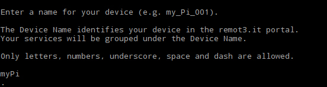

6. Initially you won’t have any Weaved services installed, so the upper part is empty.  Enter **1** to attach Weaved to an existing TCP service (host) on your Raspberry Pi.  You should now see the following screen:

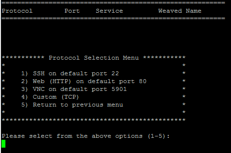

7. Enter **1** for SSH.

8. Next, we accept the default port (**y**).

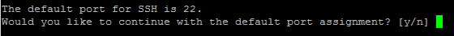

9. The installer confirms your choice and asks you to give this connection a name:

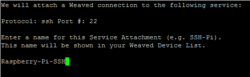

10. You will now return to the main menu, where you can see your Weaved Service Connection installed, then enter **3** to exit.

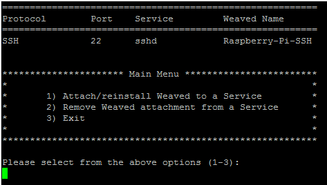

Your RPi is now ready to run headless, we just have to connect with it over ssh on our laptop to control it from the terminal. We have created two access guide one for Linux and Mac Users and the other for Windows.

## Accessing from your computer (Linux or Mac OS X)

1. We will now see how to access using your laptop to your RPi from the terminal. First, if you login to your remot3.it account,  you will get a list of your devices:

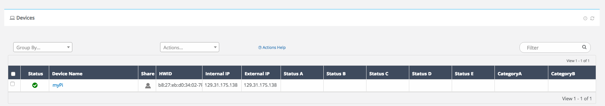

2. In your case you will have just one item. When you click on the name of you device, a pop-up will open:  

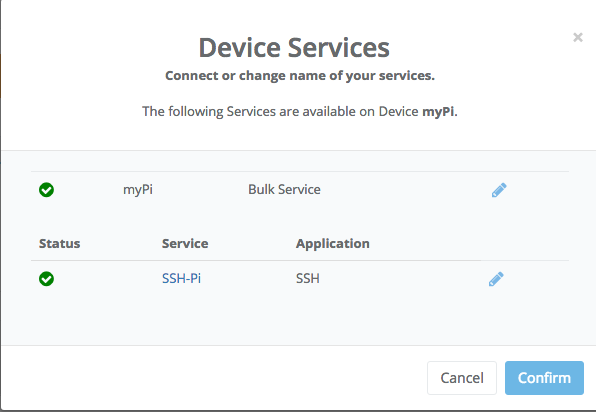

3. Click on the name of your ssh service and then "Confirm".

4. A second pop-up will appear:

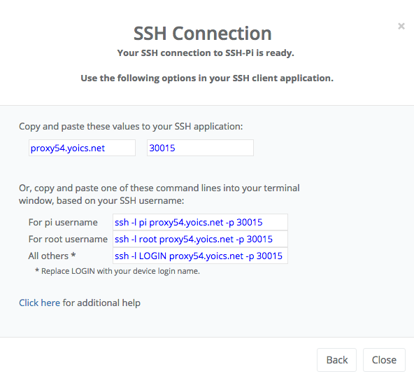

We copy the command after *For pi username*, in this example it is: ```ssh -l pi proxy54.yoics.net -p 30015```. For you it will be different.

5. Then, paste the command in your laptop or desktop terminal (If you are using a Mac or Linux all will work, but for windows you have to [install a SSH and Telnet client](http://www.chiark.greenend.org.uk/~sgtatham/putty/)).

6. The terminal is going to show you this message:

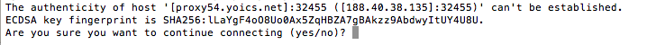

Type yes.

7. Then, you will be prompted to enter a password, you should enter the password of the root user of your RPi. If you didn't change it previously, by default is **raspberry**

You will see on your laptop's terminal that now you are user pi. You are connected from your laptop to your RPi!! You don't need the display and mouse anymore!

<small>To manage remote terminal sessions we suggest you use Screen, check out the tutorial [here](../SupplementaryMaterial/Screen.md).</small>

o know more about more advance details of how connect remotely go to the [advanced guide](SupplementaryMaterial/Advanced_remote_functionalities.md).

#### [Next Step](../Chapter_1/Python_warmup.md)

## Accessing from your computer (Windows)

If your computer operative  system is Windows, to access remotely you will need to install PuTTY, which  is a free implementation of SSH and Telnet for Windows and Unix platforms.

1. To download it click [here]( http://www.chiark.greenend.org.uk/~sgtatham/putty/download.html).

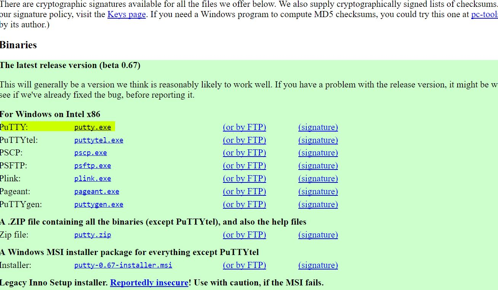

2. Once downloaded, proceed with the standard installation.

3. Once installed double click on the **putty.exe** and you will see a window that looks like the one below:

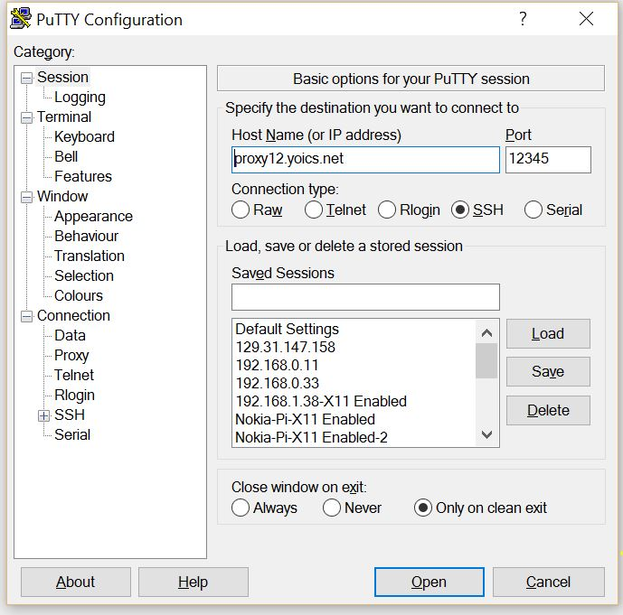

4. Then, if you login to your remot3.it account,  you will get a list of the services linked to your devices:


5. In your case you will have just one item. When you click on the name of you device, a pop-up will open:  


6. Click on the name of your ssh service and then "Confirm".

7. A second pop-up will appear:


5. Insert the server address and port obtained from remot3.it into Putty and connect!

6. When asked for username and password, please use your RPi username and password to log-in. (Please note, this is not weaved username and password).


To exit your putty session, type "exit" and enter.

<small>To manage remote terminal sessions we suggest you use Screen, check out the tutorial [here](../SupplementaryMaterial/Screen.md).</small>

To know more about more advance details of how connect remotely go to the [advanced guide](SupplementaryMaterial/Advanced_remote_functionalities.md).

#### [Next Step](../Chapter_1/Python_warmup.md)
