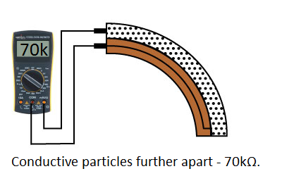
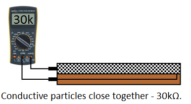
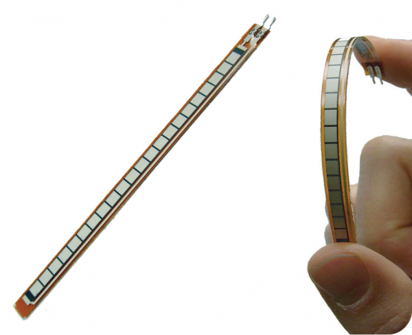
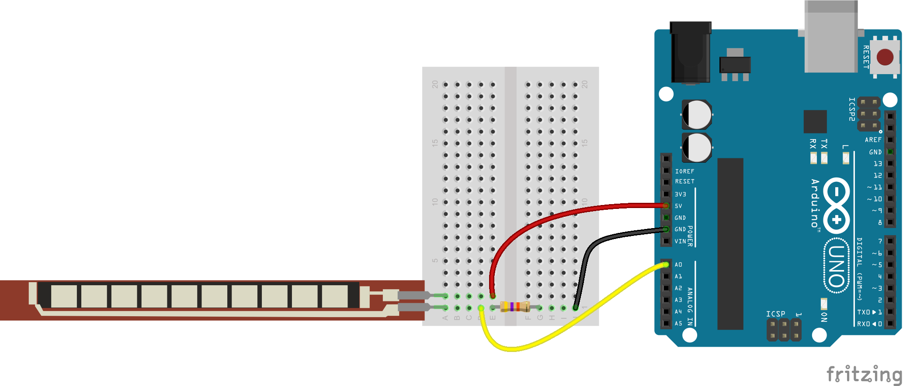
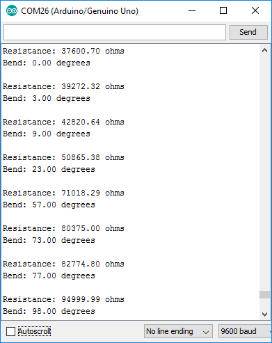

# Sensors

In this section we are going to see how  to receive data from different sensors on the Arduino. The sensors we are going to use are:

1. [Flex Sensor](#flex-sensor)
2. [Light Sensor](#light-sensor)

### Flex Sensor

##### How it Works

One side of the sensor is printed with a polymer ink that has conductive particles embedded in it. When the sensor is straight, the particles give the ink a resistance of about 30k Ohms. When the sensor is bent away from the ink, the conductive particles move further apart, increasing this resistance (to about 50k-70K Ohms when the sensor is bent to 90°, as in the diagram below).

  

<small>Sensor bent</small>

When the sensor straightens out again, the resistance returns to the original value. By measuring the resistance, you can determine how much the sensor is being bent.

  
<small>Sensor straight</small>

The flex sensor is designed to be flexed in just one direction – away from the ink – as demonstrated in the image below.



<small>Flex sensor bend direction (from SpectraSymbol Datasheet).</small>
Bending the sensor in the other direction will not produce any reliable data, and may damage the sensor. Also take care not to bend the sensor close to the base, as they have a tendency to kink and fail.

##### Example Circuit
The simplest way to incorporate this sensor into your project is by using it in a voltage divider. This circuit requires one resistor. Many values from 10KΩ to 100KΩ will work. If you have a resistor kit, you may want to introduce some trial-and-error to hone in on that perfect static resistance.

A value between the minimum and maximum resistance values is usually a good choice. We’ll use a 47kΩ resistor in this example. Here’s the hookup:


<small>Example circuit fritzing diagram</small>

##### Code
1. You can copy and paste this code in your Arduino IDE.  

```
/******************************************************************************
Flex_Sensor_Example.ino
Example sketch for SparkFun's flex sensors
  (https://www.sparkfun.com/products/10264)
Jim Lindblom @ SparkFun Electronics
April 28, 2016

Create a voltage divider circuit combining a flex sensor with a 47k resistor.
- The resistor should connect from A0 to GND.
- The flex sensor should connect from A0 to 3.3V
As the resistance of the flex sensor increases (meaning it's being bent), the
voltage at A0 should decrease.

Development environment specifics:
Arduino 1.6.7
******************************************************************************/
const int FLEX_PIN = A0; // Pin connected to voltage divider output

// Measure the voltage at 5V and the actual resistance of your
// 47k resistor, and enter them below:
const float VCC = 4.98; // Measured voltage of Ardunio 5V line
const float R_DIV = 47500.0; // Measured resistance of 3.3k resistor

// Upload the code, then try to adjust these values to more
// accurately calculate bend degree.
const float STRAIGHT_RESISTANCE = 37300.0; // resistance when straight
const float BEND_RESISTANCE = 90000.0; // resistance at 90 deg

void setup()
{
  Serial.begin(9600);
  pinMode(FLEX_PIN, INPUT);
}

void loop()
{
  // Read the ADC, and calculate voltage and resistance from it
  int flexADC = analogRead(FLEX_PIN);
  float flexV = flexADC * VCC / 1023.0;
  float flexR = R_DIV * (VCC / flexV - 1.0);
  Serial.println("Resistance: " + String(flexR) + " ohms");

  // Use the calculated resistance to estimate the sensor's
  // bend angle:
  float angle = map(flexR, STRAIGHT_RESISTANCE, BEND_RESISTANCE,
                   0, 90.0);
  Serial.println("Bend: " + String(angle) + " degrees");
  Serial.println();

  delay(500);
}

```
2. Upload it on your Arduino.

3. Open the Serial Monitor by clicking on this button:


4. Set the monitor's baud rate to 9600 bps from the dropdown on the bottom right corner of the window
**Note:** Always check that the monitor's baud rate corresponds to the one you set by code, otherwise you will see only random ASCII characters.


5. Now, if you bend the flex sensor, you should see resistance and estimated angle calculations change:


If the value’s don’t seem correct, make sure the constants VCC and, more importantly, R_DIV are accurate. If you used something other than a 47kΩ resistor, enter that value in for R_DIV.

Through trial-and-error, try to hone in on more accurate values for STRAIGHT_RESISTANCE and BEND_RESISTANCE – your flex sensor’s resistance when it’s straight and bent at 90°.

<small>Based on this [Sparkfun's hook up guide](https://learn.sparkfun.com/tutorials/flex-sensor-hookup-guide)</small>

### Light Sensor

We are going to use a photo-resistor. Arduino IDE provides a r
