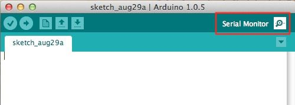
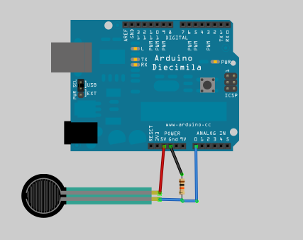
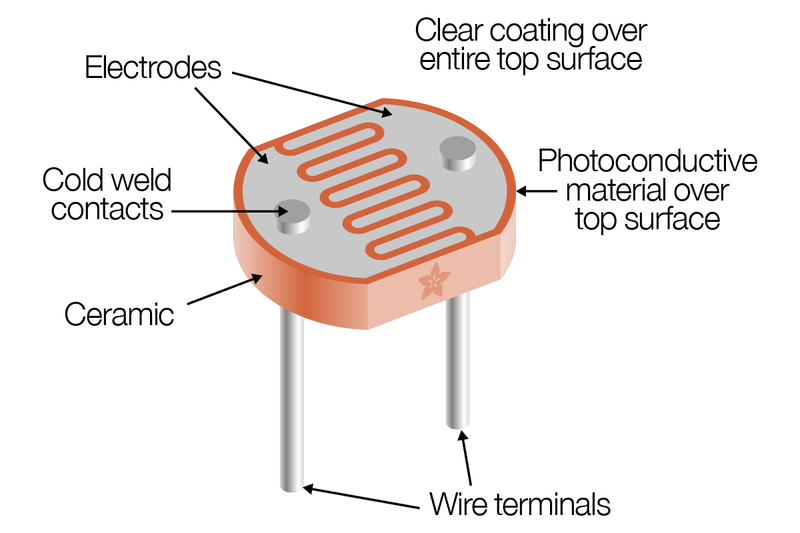

# Sensors

In this section we are going to see how  to receive data from different sensors on the Arduino. The sensors we are going to use are:

1. [Force Sensitive Resistor](#force-sensitive-resistor)
2. [Light Sensor](#light-sensor)

At the beginning of this session you should have collected a kit that is made of:
* Arduino
* 10kΩ Resistors
* 1 Force Sensitive Resistor
* 1 Photo-resistor

#### Reading the sensor information

For these exercises, there are two approaches to reading the sensor data.  
**The easy approach:** You could use your computer (Windows/Mac) to run the Arduino IDE. For this approach you need to view your output from the Arduino with the Serial Monitor. Your sensor information will be output here when the `Serial.println()` / `Serial.print()` / `Serial.write()` function is used. This can be found with the image below:

<p align="center"></p>

**The challenge:** Alternatively, if you are running the Arduino sketches from the headless (no screen) Raspberry Pi and controlling over Putty/Terminal then you could use the Python script to read the Serial port and print out to your command line on the Pi. Your sensor information will be output here when the `Serial.write()` function is used from the Arduino.

### Force Sensitive Resistor

The resistance of an force sensor varies as the force on the sensor increases or decreases. When no pressure is being applied to the force sensor, its resistance will be larger than 1MΩ. The harder you press on the sensor’s head, the lower the resistance between the two terminals drops. By combining the force sensor with a static resistor to create a [voltage divider](https://learn.sparkfun.com/tutorials/voltage-dividers)(or pull-down resistor), you can produce a variable voltage that can be read by a microcontroller’s analog-to-digital converter.

##### Example Circuit


##### Code
```C
/* FSR simple testing sketch.

Connect one end of FSR to power, the other end to Analog 0.
Then connect one end of a 10K resistor from Analog 0 to ground

For more information see www.ladyada.net/learn/sensors/fsr.html */

int fsrPin = 0;     // the FSR and 10K pulldown are connected to a0
int fsrReading;     // the analog reading from the FSR resistor divider

void setup(void) {
  // We'll send debugging information via the Serial monitor
  Serial.begin(9600);   
}

void loop(void) {
  fsrReading = analogRead(fsrPin);  

  Serial.print("Analog reading = ");
  Serial.print(fsrReading);     // the raw analog reading

  // We'll have a few threshholds, qualitatively determined
  if (fsrReading < 10) {
    Serial.println(" - No pressure");
  } else if (fsrReading < 200) {
    Serial.println(" - Light touch");
  } else if (fsrReading < 500) {
    Serial.println(" - Light squeeze");
  } else if (fsrReading < 800) {
    Serial.println(" - Medium squeeze");
  } else {
    Serial.println(" - Big squeeze");
  }
  delay(1000);
}
```

For other functionalities and more precise calibration make sure to check out [Adafruit's website](https://learn.adafruit.com/force-sensitive-resistor-fsr/using-an-fsr).

### Light Sensor
For the light sensing are going to use a photo-resistor or Cadmium-sulfide cell. CdS cells are little light sensors. As the squiggly face is exposed to more light, the resistance goes down. When its light, the resistance is about 5-10KΩ, when dark it goes up to 200KΩ.

They are very low cost, easy to get in many sizes and specifications, but are very inaccurate. Each photocell sensor will act a little differently than the other, even if they are from the same batch. The variations can be really large, 50% or higher! For this reason, they shouldn't be used to try to determine precise light levels in lux or millicandela. Instead, you can expect to only be able to determine basic light changes.

For most light-sensitive applications like "is it light or dark out", "is there something in front of the sensor (that would block light)", "is there something interrupting a laser beam" (break-beam sensors), or "which of multiple sensors has the most light hitting it", photocells can be a good choice!



##### Example Circuit
To use, connect one side of the photo cell (either one, its symmetric) to power (for example 5V) and the other side to your microcontroller's analog input pin. Then connect a 10K pull-down resistor from that analog pin to ground. The voltage on the pin will be 2.5V or higher when its light out and near ground when its dark.


##### Code
In the Arduino IDE you will find under *File → Examples → 10.StarterKit_BasicKit → p04ColorMixingLamp* an example sketch that uses three photo-resistors to control three LEDs to create a colour-changing lamp. We challenge you to tweak the code to fit your needs and to read the value from one photo-resistor.

Color Mixing Lamp Code
```C
/*
  Arduino Starter Kit example
 Project 4  - Color Mixing Lamp

 This sketch is written to accompany Project 3 in the
 Arduino Starter Kit

 Parts required:
 1 RGB LED
 three 10 kilohm resistors
 3 220 ohm resistors
 3 photoresistors
 red green and blue colored gels

 Created 13 September 2012
 Modified 14 November 2012
 by Scott Fitzgerald
 Thanks to Federico Vanzati for improvements

 http://www.arduino.cc/starterKit

 This example code is part of the public domain
 */

const int greenLEDPin = 9;    // LED connected to digital pin 9
const int redLEDPin = 10;     // LED connected to digital pin 10
const int blueLEDPin = 11;    // LED connected to digital pin 11

const int redSensorPin = A0;  // pin with the photoresistor with the red gel
const int greenSensorPin = A1;   // pin with the photoresistor with the green gel
const int blueSensorPin = A2;   // pin with the photoresistor with the blue gel

int redValue = 0; // value to write to the red LED
int greenValue = 0; // value to write to the green LED
int blueValue = 0; // value to write to the blue LED

int redSensorValue = 0; // variable to hold the value from the red sensor
int greenSensorValue = 0; // variable to hold the value from the green sensor
int blueSensorValue = 0; // variable to hold the value from the blue sensor

void setup() {
  // initialize serial communications at 9600 bps:
  Serial.begin(9600);

  // set the digital pins as outputs
  pinMode(greenLEDPin, OUTPUT);
  pinMode(redLEDPin, OUTPUT);
  pinMode(blueLEDPin, OUTPUT);
}

void loop() {
  // Read the sensors first:

  // read the value from the red-filtered photoresistor:
  redSensorValue = analogRead(redSensorPin);
  // give the ADC a moment to settle
  delay(5);
  // read the value from the green-filtered photoresistor:
  greenSensorValue = analogRead(greenSensorPin);
  // give the ADC a moment to settle
  delay(5);
  // read the value from the blue-filtered photoresistor:
  blueSensorValue = analogRead(blueSensorPin);

  // print out the values to the serial monitor
  Serial.print("raw sensor Values \t red: ");
  Serial.print(redSensorValue);
  Serial.print("\t green: ");
  Serial.print(greenSensorValue);
  Serial.print("\t Blue: ");
  Serial.println(blueSensorValue);

  /*
  In order to use the values from the sensor for the LED,
  you need to do some math. The ADC provides a 10-bit number,
  but analogWrite() uses 8 bits. You'll want to divide your
  sensor readings by 4 to keep them in range of the output.
  */

  redValue = redSensorValue / 4;
  greenValue = greenSensorValue / 4;
  blueValue = blueSensorValue / 4;

  //  print out the mapped values
  Serial.print("Mapped sensor Values \t red: ");
  Serial.print(redValue);
  Serial.print("\t green: ");
  Serial.print(greenValue);
  Serial.print("\t Blue: ");
  Serial.println(blueValue);

  /*
  Now that you have a usable value, it's time to PWM the LED.
  */
  analogWrite(redLEDPin, redValue);
  analogWrite(greenLEDPin, greenValue);
  analogWrite(blueLEDPin, blueValue);
}
```

### Acknowledgement
<small>Based on [this](https://learn.adafruit.com/photocells/using-a-photocell) Adafruit guide and Adafruit's [Photocell's page](https://www.adafruit.com/product/161).</small>
