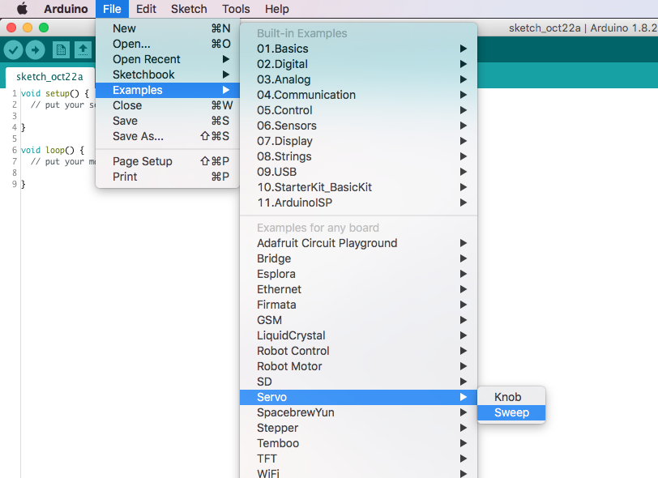

# Actuators

In this section we are going to learn about actuators and how to control them .

1. [Piezo Buzzer](#piezo_buzzer)
2. [Servo Motor](#servo_motor)
3. [DC Motor](#dc_motor)
4. [Stepper Motor](#stepper_motor)


At the beginning of this session you should have collected a kit that is made of:
* [Buzzer](http://uk.rs-online.com/web/p/piezo-buzzer-components/0457011/)
* [Servo Motor](https://www.rapidonline.com/feetech-fs90-mini-servo-120-9g-37-1339)
* [Adafruit TB6612 Driver](https://learn.adafruit.com/adafruit-tb6612-h-bridge-dc-stepper-motor-driver-breakout/overview)
* [DC Motor](https://www.adafruit.com/product/711)
* [Stepper Motor](https://www.adafruit.com/product/324)

### Piezo Buzzer
A [piezoelectric speaker](https://www.wikiwand.com/en/Piezoelectric_speaker) (sometimes colloquially called a "piezo") or buzzer is a loudspeaker that uses the piezoelectric effect for generating sound. The initial mechanical motion is created by applying a voltage to a piezoelectric material, and this motion is typically converted into audible sound using diaphragms and resonators.

<small>When fixed to a metallic diaphragm and excited with an alternating voltage, the diameter of the disc varies by a small amount, this causes dishing of the diaphragm which gives a much louder sound.</small>

##### Example Circuit
From the kit you are going to need:
* Buzzer
* Jumper Wires
* Arduino


##### Code
For the code you can use the **Example->2.Digital->toneMelody**. Feel free to play around with it.

You can also try to control this buzzer from your Raspberry Pi [here](http://gpiozero.readthedocs.io/en/stable/api_output.html?highlight=servo#buzzer) you can find the GPIOzero API Reference.

### Servo Motor
A [servo motor](https://www.wikiwand.com/en/Servomotor#/RC_servos) is a rotary actuator or linear actuator that allows for precise control of angular or linear position, velocity and acceleration. It consists of a suitable motor coupled to a sensor for position feedback. It also requires a relatively sophisticated controller, often a dedicated module designed specifically for use with servomotors.

##### Example Circuit
From the kit you are going to need:
* Servo Motor
* Jumper Wires
* Arduino


##### Code
For this example you are going to use the built-in [servo library](https://www.arduino.cc/en/Reference/Servo) by Arduino and we are going to use the built-in sketch **Example->Servo->Sweep**


```
/* Sweep
 by BARRAGAN <http://barraganstudio.com>
 This example code is in the public domain.

 modified 8 Nov 2013
 by Scott Fitzgerald
 http://www.arduino.cc/en/Tutorial/Sweep
*/

#include <Servo.h>

Servo myservo;  // create servo object to control a servo
// twelve servo objects can be created on most boards

int pos = 0;    // variable to store the servo position

void setup() {
  myservo.attach(9);  // attaches the servo on pin 9 to the servo object
}

void loop() {
  for (pos = 0; pos <= 180; pos += 1) { // goes from 0 degrees to 180 degrees
    // in steps of 1 degree
    myservo.write(pos);              // tell servo to go to position in variable 'pos'
    delay(15);                       // waits 15ms for the servo to reach the position
  }
  for (pos = 180; pos >= 0; pos -= 1) { // goes from 180 degrees to 0 degrees
    myservo.write(pos);              // tell servo to go to position in variable 'pos'
    delay(15);                       // waits 15ms for the servo to reach the position
  }
}

```

You can also try to control this servo motor from your Raspberry Pi [here](http://gpiozero.readthedocs.io/en/stable/api_output.html?highlight=servo) you can find the GPIOzero API Reference.

### Dc Motor

##### Example Circuit
* Stepper Motor
* Adafruit TB6612 Driver
* Jumper Wires
* Arduino


##### Code

### Stepper Motor
A [stepper motor](https://www.wikiwand.com/en/Stepper_motor) or step motor or stepping motor is a brushless DC electric motor that divides a full rotation into a number of equal steps. The motor's position can then be commanded to move and hold at one of these steps without any position sensor for feedback (an open-loop controller), as long as the motor is carefully sized to the application in respect to torque and speed.

##### Example Circuit
From the kit you are going to need:
* Stepper Motor
* Adafruit TB6612 Driver
* Jumper Wires
* Arduino


##### Code
For this example you are going to use the built-in [stepper library](https://www.arduino.cc/en/Reference/Stepper) by Arduino and we are going to use the built-in sketch **Example->Stepper->stepper_oneRevolution**


```
/*
 Stepper Motor Control - one revolution

 This program drives a unipolar or bipolar stepper motor.
 The motor is attached to digital pins 8 - 11 of the Arduino.

 The motor should revolve one revolution in one direction, then
 one revolution in the other direction.


 Created 11 Mar. 2007
 Modified 30 Nov. 2009
 by Tom Igoe

 */

#include <Stepper.h>

const int stepsPerRevolution = 200;  // change this to fit the number of steps per revolution
// for your motor

// initialize the stepper library on pins 8 through 11:
Stepper myStepper(stepsPerRevolution, 8, 9, 10, 11);

void setup() {
  // set the speed at 60 rpm:
  myStepper.setSpeed(60);
  // initialize the serial port:
  Serial.begin(9600);
}

void loop() {
  // step one revolution  in one direction:
  Serial.println("clockwise");
  myStepper.step(stepsPerRevolution);
  delay(500);

  // step one revolution in the other direction:
  Serial.println("counterclockwise");
  myStepper.step(-stepsPerRevolution);
  delay(500);
}

```
