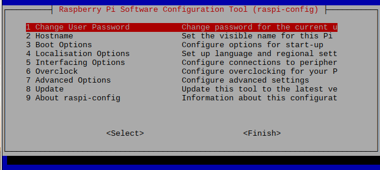

# Setting up your Raspberry Pi 3 Model B

The goal of this first session is to set up our Raspberry Pis, so they can run "headless". This means that we will be able to control the RPi remotely from our laptops, without the need to connect the RPi to a screen, keyboard and mouse each time we use it. This initial setup, therefore, reduces the time we spend in setting up our Rpi each time we use it and minimizes the cabling, this, will be fundamental when our Pi will be inserted in our Pixel.

We will use the [SSH](https://en.wikipedia.org/wiki/Secure_Shell) protocol to connect from our laptop to the RPi over the Imperial/eduroam WiFi network. It let us establish a secure network communication on an unsecured network. To achieve this we will rely on [remot3.it services](https://www.remot3.it) as we will later explain.

To setup our RPi we will use the terminal. If you are new to the terminal can be a bit overwhelming at first, don't panic and follow the steps carefully!
We have created a [cheat sheet](...) to help you out.

## General Setup for Raspberry Pi

At first we will setup the RPi using peripherals. Each team should get the following equipment:

[//]: # (TODO: review materials list)

  * monitor/touch screen
  * HDMI-DVI cable
  * power cable
  * keyboard (optional)
  * mouse (optional)
  * SD card

[//]: # (TODO: add image)


1. Connect mouse and keyboard using the USB ports on the Rpi. Connect the display with provided HDMI-DVI cable plugging it in the HDMI port of the RPi.

[//]: # (TODO: add image)


2. Insert the micro-SD card in the back of the RPi

[//]: # (TODO: add image)


3. Using Y-cable, power the Rpi up by plugging in the charger.

4. If you are using a NOOBS SD card: The RPi will start the setup and it will ask you which operating system you want to install. From the menu select to install Raspbian.

5. Once the operating system starts, click on the __terminal__ icon next to the menu to open it.

[//]: # (TODO: add image)


**Note:** Now we will start running some commands in the terminal.  We will run them as a **root user**, the root has the permission to modify files or default settings as administrator. By default on Raspbian (the operating system of our RPIs) the **root user** is **pi** and the **root password** associated to the root user is **raspberry**.
To operate as a root user in the terminal every command is preceded by the ```sudo``` command.

6. Type the following command and press 'Enter' to open the configuration menu of the RPi:

``` bash
$ sudo raspi-config
```

The terminal will show a menu. The options can be navigated with the vertical keys of your keyboard, to accept the options press 'Enter', to finish press the lateral keys of the keyboard.



7. First we set up the keyboard to prevent any problem when we will change the root password. We access the option: __4 Localisation Options --> Change Keyboard Layout__. Then we choose generic 105 key, and then UK. Then we can choose the default options that the menu is prompting.

[//]: # (TODO: add image, modify the text at 1.7 if required)


8. We go back to the main menu and change the timezone from the __4 Localisation Options__ menu.

[//]: # (TODO: add images, modify the text at 1.7 if required)


9. Now we will change the root user password. This increases the security of the connection we will establish from our laptop to the RPi. Since you are sharing this RPi with your teammates choose a password together. To change the password we go back to the main menu and  we choose the first option: __1 Change User Password__.

[//]: # (TODO: add a more verbose explanation)


We have set the new password, please remember this password and keep it safe. Do not reboot the RPi yet.

10. Now we will check that the SSH is enabled. We need to enable it to connect with the RPi remotely. From the main menu we access: __5 Interfacing Options --> P2 SSH__.


And we press "Enable".

[//]: # (TODO: add image)


11. Exit the menu, you will re-enter the terminal.

## WiFi setup

#### Step 1: Setting the WiFi from Imperial College network with a guest account

In the classroom you will be given a guest username (i.e *guest000000*, 'guest' followed by a sequence of 6 digits) and a guest password (8 characters long, alphanumeric).
The guest account is valid for 90 days only. So you should change the setting with your personal college credentials. We have prepared a step by step tutorial to assist you in the process. You can find the tutorial [here](...). The tutorial also includes setup for the **eduroam** network.

1. Click on WiFi icon and connect your RPi to Imperial.


2. Open your browser and type this IP address on the search bar:
`192.168.1.1`


3. Log in with the provided credentials.


## Installing Python

To install Linux packages in our RPi system we use the command: ```sudo apt-get install name_of_package``` in the terminal. Each installation could take some minutes.

1. Updating operative system
```bash
sudo apt-get update
```
2. Installing C lib needed by Python
```bash
sudo apt-get -y install libffi-dev
sudo apt-get -y install libssl-dev
```
3. Installing Pythons
```bash
sudo apt-get -y install build-essential python-dev python-openssl
sudo apt-get -y install python-setuptools
sudo apt-get -y remove --purge python-pip
sudo apt-get -y install python-pip
sudo pip install --upgrade pip
```

We suggest that after this lesson you back up the image of your RPi at home to have a copy af this . In order to do so we have prepared a [guide](/SupplementaryMaterial/BackingUpRPi/BackingUpRPi.md).
