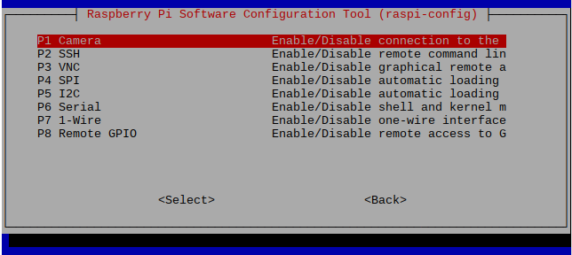
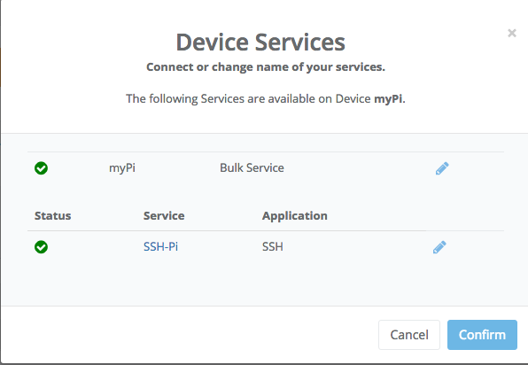

# Setting up your Raspberry Pi 3 Model B

The goal of this session is to set up our Raspberry Pis, so they can run "headless". This means that we will be able to control the RPi remotely from our laptops, without the need to connect the RPi to a screen, keyboard and mouse each time we use it. This initial setup, therefore, reduces the time we spend in setting up our Rpi and minimizes the cabling, this, will be fundamental when our Pi will be inserted in our Pixel.

We will use the [SSH](https://en.wikipedia.org/wiki/Secure_Shell) protocol to connect from our laptop to the RPi over the Imperial/eduroam WiFi network. It let us establish a secure network communication on an unsecured network.

To setup our RPi we will use the terminal. If you are new to the terminal can be a bit overwhelming at first, don't panic and follow the steps carefully!
We have created a [cheat sheet](...) to help you out.

### Step 1: General Setup for Raspberry Pi

At first we will setup the RPi using peripherals. Each team should get the following equipment:
[comment]: <> (TODO: review materials list)
  * monitor
  * HDMI-DVI cable
  * power cable
  * keyboard
  * mouse
  * SD card

[comment]: <> (TODO: add image)


1.1 Connect mouse and keyboard using the USB ports on the Rpi. Connect the display with provided HDMI-DVI cable plugging it in the HDMI port of the RPi.

[comment]: <> (TODO: add image)


1.2 Insert the micro-SD card in the back of the RPi

[comment]: <> (TODO: add image)


1.3 Using Y-cable, power the Rpi up by plugging in the charger.

1.4 The Rpi will start the setup and it will ask you which operating system you want to install. From the menu select to install Raspbian.

1.5  Once the operating system starts, click on the __terminal__ icon next to the menu to open it.

[comment]: <> (TODO: add image)


**Note:** Now we will start running some commands in the terminal.  We will run them as a **root user**, the root has the permission to modify files or default settings as administrator. By default on Raspbian (the operating system of our RPIs) the **root user** is **pi** and the **root password** associated to the root user is **raspberry**.
To operate as a root user in the terminal every command is preceded by the *sudo* command.

1.6 Type the following command and press 'Enter' to open the configuration menu of the RPi:

``` bash
$ sudo raspi-config
```

The terminal will show a menu. The options can be navigated with the vertical keys of your keyboard, to accept the options press 'Enter', to finish press the lateral keys of the keyboard.


1.7 First we set up the keyboard to prevent any problem when we will change the root password. We access the option: __4 Localisation Options --> Change Keyboard Layout__. Then we choose generic 105 key, and then UK. Then we can choose the default options that the menu is prompting.

[comment]: <> (TODO: add image, modify the text at 1.7 if required)


1.8 We go back to the main menu and change the timezone from the __4 Localisation Options__ menu.

[comment]: <> (TODO: add images, modify the text at 1.7 if required)


1.9 Now we will change the root user password. This increases the security of the connection we will establish from our laptop to the RPi. Since you are sharing this RPi with your teammates choose a password together. To change the password we go back to the main menu and  we choose the first option: __1 Change User Password__.

[comment]: <> (TODO: add a more verbose explanation)


We have set the new password. Do not reboot the RPi yet.

1.10 Now we will check that the SSH is enabled. We need to enable it to connect with the RPi remotely. From the main menu we access: __5 Interfacing Options --> P2 SSH__.



And we press "Enable".

[comment]: <> (TODO: add image)


1.11 Exit the menu, you will re-enter the terminal. Reboot the RPi by entering:
``` bash
$ reboot
```

### Step 2: Setting WiFi from Imperial College network

At the moment there is no IP address assigned to our RPi. Therefore to set up the WiFi, to do so we need to modify a configuration file.

2.1  First we back up the configuration file *wpa_supplicant.conf*, to do so we enter the command:

```bash
$ sudo cp /etc/wpa_supplicant/wpa_supplicant.conf /etc/wpa_supplicant/wpa_supplicant.conf_backup
```

2.2 Then we edit the *wpa_supplicant.conf*. The default text editor installed in the RPi is _nano_. To edit a file with the nano editor is sufficient to enter the command ```nano /path/to/file```. Therefore to edit *wpa_supplicant.conf* we enter the following command with admin user permission:
```bash
$ sudo nano /etc/wpa_supplicant/wpa_supplicant.conf
```

This file should just have the next line at the beginning:
```bash
ctrl_interface=DIR=/var/run/wpa_supplicant GROUP=netdev
update_config=1
```

2.3 Then we add to the content of *wpa_supplicant.conf* the lines after # IC (**the configuration is case sensitive, so make sure you do not have typos**):

```bash
ctrl_interface=DIR=/var/run/wpa_supplicant GROUP=netdev
update_config=1


# IC
network={
        ssid="Imperial-WPA"
        proto=RSN
        key_mgmt=WPA-EAP
        pairwise=CCMP
        auth_alg=OPEN
        eap=PEAP
        identity="ic\COLLEGE_USERNAME"
        password="YOUR_PASSWORD"
}
```
**Note:** This is the Imperial College configuration if you want to connect to the eduroam network follow the Alternative Step 2

2.4 Now we have to replace "COLLEGE_USERNAME" with a valid college username and "YOUR_PASSWORD" with the account's password. If you are not comfortable in writing your password in plain text while working with your team, leave the field blank and follow step 3 to encrypt your password before setting it up in the *wpa_supplicant.conf*.

2.5 (Optional) If you have replaced your password in the previous step you can check if the connection works by rebooting your RPi. One the system starts again the RPi should connect automatically to the WiFi.

### Alternative Step 2: Setting WiFi from eduroam network

If you are not able to connect to the Imperial-WPA network you can also use the eduroam one. We will need to execute steps 2.1 and 2.2 of the previous section on how to modify the settings for the Imperial College network. Then in step 2.3 the informations we need to enter are slightly different:

```bash
ctrl_interface=DIR=/var/run/wpa_supplicant GROUP=netdev
update_config=1


# eduroam
network={
        ssid="eduroam"
        proto=RSN
        key_mgmt=WPA-EAP
        pairwise=CCMP
        auth_alg=OPEN
        eap=PEAP
        identity="COLLEGE_USERNAME@ic.ac.uk"
        password="YOUR_PASSWORD"
}
```

**Note:** If you want your RPi to be able to connect to different networks you can include multiple network={⋯} entries.

2.4a You will have to replace "COLLEGE_USERNAME" with a valid username. You can change "@ic.ac.uk" with any domain that has accredited access to the eduroam network (e.g "@network.rca.ac.uk"). Replace "YOUR_PASSWORD" with the password related to that account. If you are not comfortable in writing your password in plain text while working with your team, leave the field blank and follow step 3 to encrypt your password before setting it up in the *wpa_supplicant.conf*.

2.5 (Optional) If you have replaced your password in the previous step you can check if the connection works by rebooting your RPi. One the system starts again the RPi should connect automatically to the WiFi.

### Step 3: Encrypting Your Password

3.1 In order not to store the password in a plain text we **encrypt** our password with an **MD4 hash generated** one. You can generate the hash like this with the next Linux command:

```bash
$ echo -n 'YOUR_PASSWORD' | iconv -t utf16le | openssl md4
```
This command will display the encrypted password on your terminal like:
```bash
$ (stdin)= a6c71eedc2eacbca84003336a4a62a1c
```
Then you can copy the string that was generated in your terminal screen similar to the one of the example above: a6c71eedc2eacbca84003336a4a62a1c.

**Note:** Also you can save the hash from your password in a file and then read its content:
```bash
$ echo -n 'YOUR_PASSWORD' | iconv -t utf16le | openssl md4 > hash.txt
$ cat hash.txt
```
The *cat* command is used to read and concatenate files.

Then open the *wpa_supplicant.conf* to add the hashed password you generate:

```bash
$ sudo nano /etc/wpa_supplicant/wpa_supplicant.conf
```
In the password field replace "YOUR_PASSWORD" with the string you generated as hexadecimal characters, and we add the 'hash:'-prefix) in the similar fashion as in the example bellow:

```bash
# IC
network={
        ssid="Imperial-WPA"
        proto=RSN
        key_mgmt=WPA-EAP
        pairwise=CCMP
        auth_alg=OPEN
        eap=PEAP
        identity="ic\COLLEGE_USERNAME"
        password=hash:a6c71eedc2eacbca84003336a4a62a1c
}
```
A last security step to do is to remove the bash history, with all the commands we had typed on the terminal. Therefore, we do it like:
```bash
$ history -w
$ history -c
```
Then we reboot again the RPi to check that the password was properly set up.

### Installing Python

To install Linux packages in our system we must use the command: ```sudo apt-get install name_of_package```. The installation could take some minutes.

**Updating operative system**
```bash
sudo apt-get update
```
**Installing C lib needed by Python:**
```bash
sudo apt-get -y install libffi-dev
sudo apt-get -y install libssl-dev
```
**Installing Python:**

```bash
sudo apt-get -y install build-essential python-dev python-openssl
sudo apt-get -y install python-setuptools
sudo apt-get -y remove --purge python-pip
sudo apt-get -y install python-pip
sudo pip install --upgrade pip
```
**Installing other text editor:**
```bash
sudo apt-get -y install vim
```
### Remote connection to your Raspberry Pi
**remot3.it** services connect you easily and securely to your Pi from a mobile app, browser window and a terminal. remot3.it is based on weaved. Control remote computers using tcp hosts such as SSH. You will be able to connect to your RPi from laptop or desktop at home. The free remot3.it account allows for multiple registered services and 8 hours connections on up to 1 concurrent service(s).

##### Installing weaved:
We need to install weaved to be able to connect our RPi. To install it:
```bash
sudo apt-get -y install weavedconnectd
```

##### Weaved configuration:

* To configure weaved in our RPi, first we need to open an account on the [remot3.it](https://www.remot3.it/web/index.html) website. You can register from your laptop or desktop. You could also use the credentials of a weaved account, if you have one already.
* Once you have it, from your Rpi terminal you will execute a command to link your RPi to your remot3.it account:
```bash
sudo weavedinstaller
```
* Enter your remot3.it account username and password. Next, you will see this menu:


* Then enter a name for your RPi (e.g. "myPI").


* Initially you won’t have any Weaved services installed, so the upper part is empty.  Enter **1** to attach Weaved to an existing TCP service (host) on your Raspberry Pi.  You should now see the following screen:


* Enter **1** for SSH.

* Next, we accept the default port (**y**).


* The installer confirms your choice and asks you to give this connection a name (you can make it up, but remember to make a name easy for you to identify a specific RPi in case you have more than one attached to the weaved service.):


You will now return to the main menu, where you can see your Weaved Service Connection installed, then enter **3** to exit.


### Accessing from your computer (Linux or Mac OS X)

We sill see here how you can access using your laptop or any other desktop from any terminal. First, if you login to your remot3.it account,  you will get a list of your devices:


In your case you will have just one item. When you click on the name of you device, a pop-up will open:  



Click on the name of your ssh service and then "Confirm".

A second pop-up will appear:


Then we copy the command after *For pi username*, in this example it is: ```ssh -l pi proxy54.yoics.net -p 30015```. For you it will be different. Then, paste the command in your laptop or desktop terminal (If you are using a Mac or Linux all will work, but for windows you have to [install a SSH and Telnet client](http://www.chiark.greenend.org.uk/~sgtatham/putty/)).

The terminal is going to show you this message:

Type yes.

Then, you will be prompted to enter a password, you should enter the password of your RPi. If you didn't change it previously, by default is **raspberry**

Then, you are connected from your laptop to your RPi!! You don't need the display and mouse anymore!

### Accessing from your computer (Windows)

If your computer operative  system is Windows, to access remotely you will need to install PuTTY, which  is a free implementation of SSH and Telnet for Windows and Unix platforms. To download it click [here]( http://www.chiark.greenend.org.uk/~sgtatham/putty/download.html).


Once downloaded, double click on the **putty.exe** and you will see the window looks like below:


Then, if you login to your remot3.it account,  you will get a list of the services linked to your devices:


In your case you will have just one item with a Type SSH as in the first line at the screen shoot above. When you click on the name of you device, your browser will open and show you a window like this:  


Insert the server address and port obtained from Weaved.com into Putty and connect!

When asked for username and password, please use your RPi username and password to log-in. (Please note, this is not weaved username and password).

To exit your putty session, type "exit" and enter.

### Virtual terminal

Remember you can just be connected during 30 minutes using **weaved**, after that time you have to connect again to your account and do the same procedure we explained in the previous section. Therefore we will show you how a *virtual terminal* can help you when you are working on your RPi.

**Screen** is a full-screen software program allows you to use multiple windows (virtual VT100 terminals) in Unix. It offers a user to open several separate terminal instances inside a one single terminal window manager.

The screen application is very useful, if you are dealing with multiple programs from a command line interface and for separating programs from the terminal shell. It also allows you to share your sessions with others users and detach/attach terminal sessions.

##### When to use screen?

One of the advantages of *Screen*, is that you can detach it. Then, you can restore it without losing anything you have done on the *Screen*. One of the typical scenario where *Screen* is of great help is when you are in the middle of SSH session and you want to download a file, update the operative, or transfer a big file to your RPi. The process could be 2 hours long. If you disconnect the SSH session, or suddenly the connection lost by accident, then the download process will stop. You have to start from the beginning again. To avoid that, we can use screen and detach it.

###### Installing screen
The screen program allows you to use multiple windows (virtual VT100 terminals) in Unix. If your local computer crashes, or you are connected remotely and lose the connection, the processes or login sessions you establish through screen don't get lost.

```bash
sudo apt-get -y install screen
```
###### Some Examples to use screen

* When you are in your terminal, you can create a *screen* or virtual terminal e.g. we will name the screen *mysession*:


* Then you will be automatically attached to your screen or virtual terminal, that from now on we will call just *screen*. You can execute now commands and work in the terminal:


* You can detach from the *screen* by pressing “Ctrl-A” and “d“. Then we will go to our terminal outside the *screen* session. Then we can check the list of *screens*:


* We get the list and the screen ID. If we want to attach to a particular *screen*:


###### Basic commands to work with the virtual terminals

|Screen command| Description|
|:-------------|:-----------|
| ```screen -S name_of_terminal```    | Assigning name to the virtual terminal or screen session.|
|```screen -ls``` | List all the virtual sessions or screens opened. |
|```screen -X -S name_of_terminal quit```| Kill an specific virtual terminal.|
|```screen -r name_of_terminal```| Attach to the virtual terminal or screen.|
| Press “Ctrl-A” and “d“ | Detach from virtual terminal  or screen.|
| Press "Ctrl-A” and “K” | This command will leave and kill the virtual terminal or screen |
| Press “Ctrl-A” and “n“ | Switching to the next virtual terminal or screen.|
|Press “Ctrl-A” and “p“ | Switching to the previous virtual terminal or screen|

For more examples go to the [link](http://www.tecmint.com/screen-command-examples-to-manage-linux-terminals/) or ask the instructors.

To know more about more advance details of how connect remotely go to the [advance guide](Advance_remoteconection.md):

## Some useful tips and troubleshooting guides

### Backup RPi Image

It is useful and advisable to backup a working copy of your RPi image. For example, make a backup copy after setting up WiFi and update the library, the next time the wifi is not working, you can reformat the SD card and reinsert this backup copy to revert back to previous version. After this, your RPI get to connect back to WiFi right away like before. Here are the steps:

#### For Backing up:

##### For Windows and Mac OS

1. Download Win 32 Disk Imager if none installed on your computer [here]( https://sourceforge.net/projects/win32diskimager/)
2. Insert the SDCard into your computer (e.g. via card reader or SD card slot if your computer has one).
3. Open Win 32 Disk Imager. Select a location and give a file name for the backup image.
4. Select the right drive.
5. Click Read.
6. Once done, keep this backup copy safe. Please note that the size of the backup is the same size of your SD Card. SO please be mindful that it will take a considerable amount of disk space.

##### For replacing the image on the SD Card

#### For Windows and Mac OS

1. Download SDFormatter if none installed [here](https://www.sdcard.org/downloads/formatter_4/).
2. Download Win 32 Disk Imager if none installed [here](https://sourceforge.net/projects/win32diskimager/) or Etcher For Mac [here](https://www.etcher.io).
3. Use SDFormatter to format the SD card. Please be careful and make sure you select the correct drive letter.
4. Use Win 32 Disk Imager or Etcher to re-image the backed up image into the SD card. I.e. select the file name, the drive letter of the SD card, and then click Write. Please be careful that the correct drive letter is selected. If you wish to install a fresh Raspbian OS, you can download it [here](www.raspberrypi.org).
5. Once this is done, a new image has been rewritten on your SD Card!
