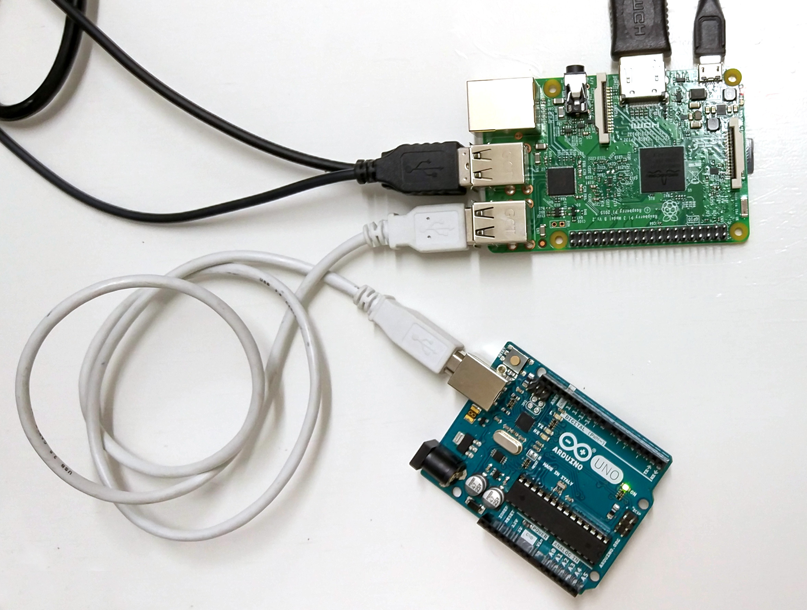
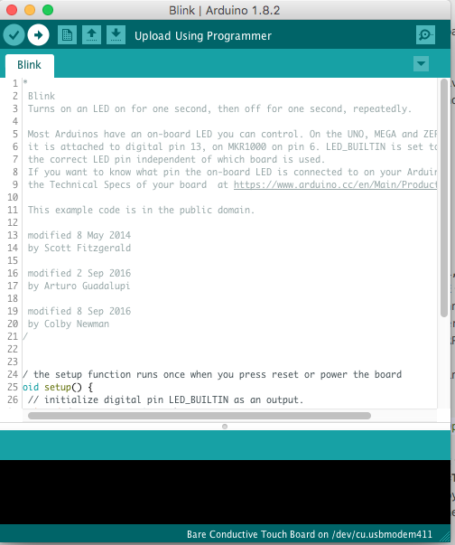
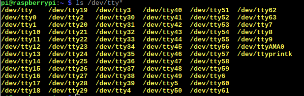

# Setting up Arduino for the Raspberry Pi

In this tutorial we will see how to connect your Raspberry Pi to your Arduino. We will start by installing the Arduino IDE that you have already seen and then move to some command line tools. These tools don't need a graphical interface and you can use them without a monitor. The last section will give you some advices on how to install these tools on your laptop.

1. [Arduino IDE](#installing-arduino)
2. [Arduino Makefile](#controlling-arduino-from-the-command-line)
2. [ino](#ino)

### Installing Arduino
From the terminal of your computer connected to the RPi via ssh type:
```bash
sudo apt-get install arduino
```
It is going to ask you to agree on using additional disk space, type Y and press Enter.

Once we have done this installation we need to grant ourselves the permission to use the serial port. In order to do so we are going to add our user (pi) to the _tty_ and _dialout_ groups with two commands:
```bash
sudo usermod -a -G tty pi
```
```bash
sudo usermod -a -G dialout pi
```

### Working with the Arduino IDE

If you now connect a keyboard, mouse and screen to your RPi, you can see that in the menu under the "Electronics" section the Arduino IDE has been installed. If you are familiar with the Arduino IDE, you can go ahead and use the Arduino IDE as you would on your laptop. The only difference is that the RPI is a slower to compile the new lines of code from the RPi with respect to a laptop.
To test if Arduino IDE is working you can connect the Arduino to the RPi using one of the available USB ports like so:



Then run the Arduino IDE.


Click **Tools->Serial Port** and select the USB serial port to which your Arduino is connected (usually /dev/ttyACM0). Then, click **Tools->Board->Arduino Uno**. Then you can open the basic sketch "Blink" by clicking on **File->Example->01. Basics-> Blink]**. You can then upload the sketch on the Arduino by clicking the "Upload" button (the one with an arrow).



Once uploaded you will see the LED on pin 13 blink.

**Note:** If /dev/ttyACM0 doesn't work, you can find out in which serial port your Arduino is plugged by unpluggin it from the RPi. Then on the Rpi terminal type:

```bash
ls /dev/tty*
```

This command lists all the connected devices, it should show "/dev/ttyAMA0". Then plug in your Arduino again and enter the same command and you should find the right port popping up.




## Controlling Arduino from the Command Line

Now we are going to see how to write Arduino programs and compile and upload them to an Arduino from the command-line, avoiding the Arduino IDE. This will be very useful when we have finalized our electronics and we want to tweak some values without changing the whole I/O setup by rewiring the Arduino.

First we are going to see how to do so using a [Makefile](https://en.wikipedia.org/wiki/Makefile) for Arduino with [arduino-mk](https://github.com/sudar/Arduino-Makefile) and then we are going to introduce another tool called ino.

#### Installing the Tools

1. First we are going to need to install the core Arduino development tools. We will need the ‘build-essential’ package that includes all the [GNU binutils](https://en.wikipedia.org/wiki/GNU_Binutils) including make etc... So, from the terminal of your computer connected to the RPi, type:

```
$ sudo apt-get install build-essential
```

2. Now we can install these two packages:

```
$ sudo apt-get install arduino-core arduino-mk
```
`arduino-core` provides all the Core Arduino libraries etc., and the Atmel AVR tool-chain (the libraries and tools designed for AVR microcontrollers, like Arduino).  
`arduino-mk` is a generic Makefile which conforms to the Gnu make syntax and which we can include into any Makefile we construct to build our code from the command line.

#### Creating an Arduino Sketch without the IDE

When we installed the Arduino IDE it created a directory called "sketchbook". This folder is made to store all your Arduino files tidily and to have them readily available for the IDE. We are going to use this folder even with our Makefile to maintain the compatibility with the IDE.

**Note:** Each Arduino sketch has the extension .ino, these are the "source files", the instructions to be built into an executable program. These source files to be built correctly with the IDE need to be contained in a folder that has the same name as the sketch i.e. with a directory tree as follows:
../sketchbook
└── blink
    └── blink.ino

Using arduino-mk we are going to create a Makefile inside the source file directory; some other auxiliary files are going to be generated during the build process as we will see.

For this example we are going to upload the same "blink" sketch we have seen before to test the functioning of our Makefile. This time we are going to create and manipulate the file from the command line.

To set up our project we follow these steps:

1. We are going to change the directory where we are and enter the sketchbook directory with this command:
```
$ cd /home/pi/sketchbook
```
2. Then we make our directory and cd to it:
```
$ mkdir blink
$ cd blink
```
3. Now we are going to create the .ino file with:
```
$ touch blink.ino
```
4. Then we want to edit the file with nano and write our sketch, so we type:
```
$ nano blink.ino
```
5. Now we want to copy/paste these lines of code (feel free to tweak the delay values to play with the blinking time):

```
#define LED_PIN 13

void setup() {
  pinMode(LED_PIN, OUTPUT);
}

void loop() {
  digitalWrite(LED_PIN, HIGH);
  delay(100); //100 millisecons ON
  digitalWrite(LED_PIN, LOW);
  delay(900); //100 millisecons OFF
}
```
We save and exit.

#### The Makefile
Now we will write a Makefile in the same directory as our .ino sketch. With   this file we can compile and ultimately upload the blink program we have just written.

1. We are still in the same "blink" directory (/home/pi/sketchbook/blink), if you have changed it simply change back with `cd`. We create another file like we did before, therefore we type:
```
$ touch Makefile
```
2. And then we edit it with nano again with:
```
$ nano Makefile
```
3. Now we will write our Makefile. Here is the source of the Makefile that you can copy-paste:
```
ARDUINO_DIR  = /usr/share/arduino
#ARDUINO_LIBS = Ethernet Ethernet/utility SPI
BOARD_TAG    = uno
ARDUINO_PORT = /dev/ttyACM0

include /usr/share/arduino/Arduino.mk
```
* `ARDUINO_DIR` is the directory where by default our Arduino folder has been created when we installed the Arduino package.
* `ARDUINO_LIBS` is the line that tells to the compiler which library are being used in the sketch. In "blink.ino" we are not using any library, that's why it has been commented out with the `#` character. If you are using any library in the future remember to include them and to remove the comment.
* `BOARD_TAG` specify the kind of board we are using. We will always be using the Arduino Uno.
* `ARDUINO_PORT` specify the USB Serial port to which our Arduino is connected.
* `include ..` tells the compiler to include generic Makefile we have installed with `arduino-mk`.


#### Build our Project
Now we are going to build our sketch. This means that we are going to create an executable version of our Sketch. The Makefile tells the compiler how to assemble all the instruction blocks. Moreover the compiler will translate what we have written in Arduino language into C++.

To build our file we simply enter:
```
$ make
```

You will see a warning fly past about depends.mk not existing. This file will be created on the first compile.
If this all works there will now be a sub-directory called ‘build-command line’, in which there are a whole bunch of files.

These files are inside the *build-uno* folder so we change our directory:
```
$ cd build-uno
```

Then to see al the files, even the hidden ones we can enter the command `ls -a` or `ls -ld .?*`

There are loads of files, including a lot which bear no resemblance to any source we have created. These are standard library files which have been compiled and which are linked into the result.

The files which are crucial to us now are:

+ *blink.elf*
+ *blink.hex*

**Note:** even if your source file was called differently from its containing directory, these two files will be named after the directory in which we are working. This will still work if you build your sketch with arduino-mk but not with the Arduino IDE.

The .hex file is an ASCII file which contains a dump of the operation codes written into the .elf file.
If you now use ```file blink.elf``` command to inspect blink.elf, you get this result:
```
blink1.elf: ELF 32-bit LSB executable, Atmel AVR 8-bit, version 1 (SYSV), statically linked, not stripped
```
As you can see, this is an Atmel 8-bit executable, not a Linux executable.
The blink.hex file is ASCII but it is the values in this file which get written into the programmable chip on the Arduino board.

#### Upload
Now we are going to upload the compiled code to the Arduino. If you have unplugged it from your Raspberry, please connect it again with the provided USB cable.
To upload the sketch simply type:
```
$ sudo make upload
```
We need to use sudo for this to get permissions to the serial device.
Now your Arduino will start blinking!!

**Note:** If it doesn't work you may have selected the wrong port. You can check to which port the Arduino is connected with the command ```ls /dev/ttyACM*``` or as we have illustrated before in the note to **Working with the Arduino IDE**.

What we have just done is ‘cross-compiled’ an executable. That is we have compiled some code on one platform, for running on another platform, or ‘flavour’ of processor.

Ino
In the first part of this tutorial we installed the core Arduino development tools and the first of the tools we were using for working at the command line.
Now we are going to install another tool; ino.
Recap
To recap, in the last part we did these installs:
$ sudo apt-get install build-essential
$ sudo apt-get install arduino arduino-core arduino-mk


Now we need some other bits and pieces, some of which, for example Python2.7, you may already have:
$ sudo apt-get install python2.7
$ sudo apt-get install python-pip
$ sudo pip install ino


What is ino?
ino is a tool written in Python. While it ultimately uses the same AVR tools that are used by the Arduino IDE, and by the Arduino-mk tool we used last time, it offers a different way of achieving the same results.
Where ino wins over other command line tools is that it hides the messy bits of project authoring and building from the user.
Personally, I like seeing all the messy stuff.
ino also includes some example and skeleton projects.
The source code for ‘blink’, which we built in the first part of this tutorial using Arduino-mk was actually pulled from one of the ino example projects.
So, now let’s use ino to create and build the same project.
As I did last time, I am going to connect a small piezo-electric buzzer to pin 13 so that we can hear that it is working.
Follow these steps:
Create a directory for it.
$ mkdir blink2 $ cd blink2
Now we use ino to initialise the blink project from one of the ino examples:
$ ino init -t blink


This will create two sub-directories in our project directory:
lib/
src/


In the src directory there is one source file, or ‘sketch’, called:
sketch.ino


If you looked at the source code you would see it is exactly the same as the blink.ino source file we created for the blink1 project in the first part of this tutorial.
In the lib directory there is one file, called .holder, which appears to be empty.
We are not using any libraries other than the defaults in this so there will be nothing in lib.
Now we build the project:
$ ino build


This will create a directory called .build (see what I mean about ino hiding the good stuff?).
In .build there are two things now:
environment.pickle
uno/


The .pickle file is a Python mechanism for taking a snap-shot of the build environment at build time.
The directory uno, is where you will find the meat.
Note that the uno directory is only called uno because it is an Arduino Uno for which we are developing, and because it is the default board type.
If we chose to use a different Arduino version, this directory would be named the same way as the board type.
Looking in the uno directory we see a bunch of stuff:
arduino/
firmware.elf*
firmware.hex
Makefile
Makefile.deps
Makefile.sketch
src/


If you looked in arduino/, you would see files which should be familiar to you if you followed the first part of this tutorial, when we built blink using Arduino-mk. There are a whole load of object files, some .d dependancy files and other things.
Now in this directory, we also see:
firmware.elf
firmware.hex


These two files correspond to the blink1.elf and blink1.hex files which were created by Arduino-mk last time.
It is these files which are used in the upload, when we issue this command, in our original project directory:
$ sudo ino upload


Hang on a second…some of the messages that flew past looked suspiciously similar, or even identical to what happened when we used our Arduino-mk Makefile to upload blink1 in the first part of this tutorial.
Well yes, all that both Arduino-mk and ino are doing in both parts of this tutorial is to call the same Arduino AVR tools.
Again, press that reset button after the upload and the LED on pin 13 will start to blink.


#### A note about these Command Line tools for your computer
If you would like to use the same tools on your computer we encourage you to do so. If you have a Linux computer you can follow exactly the same steps.

If you have Windows???

If you have Mac special attention to USB port

<small>Based on [Raspberry VI Tutorial] (http://www.raspberryvi.org/stories/arduino-cli.html#)
</small>
