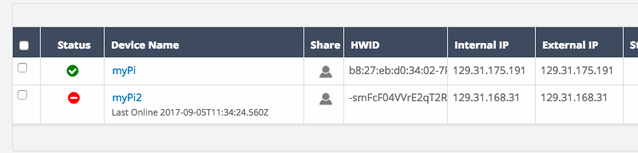
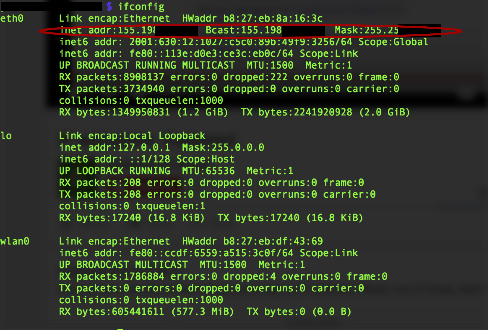
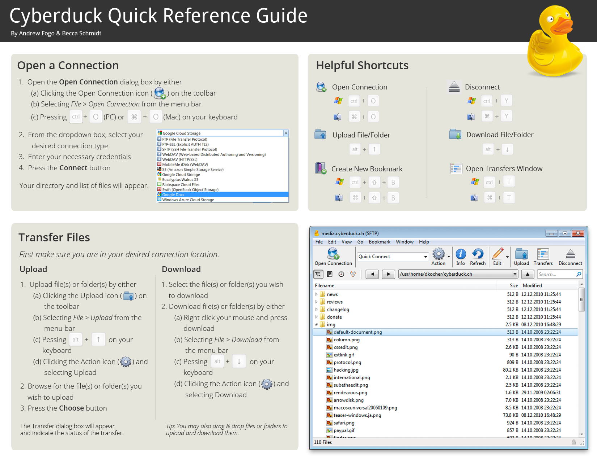

# Advanced Remote Functionalities

1. [Alternative ways to connect to your Raspberry Pi remotely](#alternative-ways-to-connect-to-your-raspberry-pi-remotely)
2. [Transferring files](#transferring-files)
3. [Managing Users on your Raspberry Pi](#managing-users-on-your-raspberry-pi)
4. [Suggested Workflow for Optional Upgrades](#suggested-workflow-for-optional-upgrades)


## Alternative ways to connect to your Raspberry Pi remotely

We already know how to connect through remot3.it service, but we know that the connection lasts 8 hours and it allows us to work on one terminal session at a time. Therefore, with the help of remot3.it and another commands we can connect to or RPi for longer and using multiple terminals. In this section we are going to connect to our RPi using its IP address.

If you do not know what is an IP address, please go to the [this link](https://www.youtube.com/watch?v=7_-qWlvQQtY) for a quick explanation. The IPs can be dynamic or static, but what is the difference? When a device is assigned a static IP address, the address does not change. Most devices use dynamic IP addresses, which are assigned by the network when they connect and change over time (which is the case for our RPi on the Imperial-WPA).

#### Checking your IP address from remot3.it
remot3.it displays the external IP of the devices you have registered. You can get your RPi's one in the *External IP* Tab:



**Note:** If you are connected with your laptop to the same network of your RPi the internal and external IP addresses will be the same like in the example above.

#### Checking your IP address from the terminal

We can use a command to check the different internet connections available on our system: _ifconfig_ or _ifconfig -a_.
```bash
$ ifconfig
```
This command allows to know the IP addresses assigned to our RPi. The _wlan0_, indicates the status of the WiFi, and _eth0_ shows the status of the Ethernet (wired) connection). In the next screen shoot shows an example of a RPi connected to the internet using the ethernet port. The red oval shows where to find the IP address assigned to the RPi for the Ethernet connection.



You can find your IP address for the WiFi connection in the corresponding _wlan0_ inet addr field.

#### Connecting via ssh knowing your IP

Once you know the IP (e.g. your IP is 192.31.123.122), you can access using your laptop terminal to the RPi as:

```bash
$ ssh pi@192.31.123.122
```
Remember that the **root username** is **pi**, the syntax for the ssh command is: ```ssh username@IP``` or ```ssh username@machine_name```.

**Note:** Since at Imperial network the IPs are dynamic, the IP is constantly changing, so could be that the IP changes in a day or hours (could be sometimes longer) and you need to repeat the last steps on your laptop of the remot3.it setup procedure.

## Transferring files

#### Using terminal

If are programing in your laptop and you want to transfer your code to test it in your RPi, you can use either Security Shell ([ssh](https://en.wikipedia.org/wiki/Secure_Shell)) or File Transfer Protocol ([sftp](https://en.wikipedia.org/wiki/SSH_File_Transfer_Protocol)).

#### SSH
| Commands| Description| Example| Syntax|
|:---------|:----------|:---------|:-------|
|```scp``` |Copy files from your machine to your RPi.| ``` scp program.py pi@123.232.232.3:/home/pi```| ```scp filename username@IP_of_machine:/path/where/to/Copy/in/RPi```|
| ```scp -r``` |Copy folders from your machine to your RPi.| ``` scp -r code pi@123.232.232.3:/home/pi```| ```scp -r folder username@IP_of_machine:/path/where/to/Copy/in/RPi```|

#### SFTP

| Commands| Description| Example| Syntax|
|:---------|:----------|:---------|:-------|
|```sftp```| Establishing SFTP session. | ```sftp pi@123.232.232.3```| ```sftp username@remote_hostname_or_IP```|
|| Establishing SFTP session from where we want to get or put a file. | ```sftp pi@123.232.232.3:/home/pi/code```| ```sftp username@remote_hostname_or_IP:/path/where/transfer/file```|

Once establish the connection through SFTP, we can transfer files as:

| Description| Description| Syntax|
|:----------|:---------|:-------|
| **Transferring Remote Files to the Local System**| Once we get into to SFTP session and we would like download files from our remote host.| ```get remoteFile```|
|| Copy the remote file to a different name by specifying the name afterwards.| ```get remoteFile localFile```|
|| Copy a directory and all of its contents by specifying the recursive option.| ```get -r someDirectory```|
|**Transferring Local Files to the Remote System**| We can use the command "put".| ```put localFile```|
||The same flags that work with "get" apply to "put". So to copy an entire local directory| ```put -r localDirectory```|

**Note:** More details and examples of SFTP in this [link](https://www.digitalocean.com/community/tutorials/how-to-use-sftp-to-securely-transfer-files-with-a-remote-server).

#### Using Software

Instead a terminal, we can use to transfer files using a software that mounts any remote server storage as a local disk in the Finder.app on Mac and the File Explorer on Windows. We suggest:

* [Cyberduck](https://cyberduck.io/?l=en)



* For just Windows you can use: [WinSCP](https://winscp.net/eng/index.php)


## Managing Users on your Raspberry Pi

You can create additional users on your Raspbian installation with the ```adduser``` command.

Enter ```sudo adduser bob``` and you will be prompted for a password for the new user *bob*. Leave this blank if you do not want a password. However, we recommend that each user get a password to access remotely in the future, for example:

```bash
$ ssh bob@123.343.1.105
```

You can delete a user on your system with the command ```userdel```. Apply the ```-r``` flag to remove their home folder too:

```bash
sudo userdel -r bob
```

The default ```pi``` user on Raspbian is a sudoer. This gives the ability to run commands as root when preceded by ```sudo```, and to switch to the root user with ```sudo su```.

## Suggested Workflow for Optional Upgrades

The next command is for updating and upgrading the Linux packages in the operative system, but it won't be executed during the workshop since it can take a while. It is always good to keep the system up to date.

In order to avoid problems due to connectivity in our terminal session when updating and upgrading the operative system, we can open a Screen session as explained in the first week at the end of the [RPI setup  section](Week1/RPIsetup/RPI_setup.md). It is recommended to use *Screen* in case the internet connection is interrupted, the update will continue on the Pi and therefore not damaging the library. We leave the command here for you to use un the future:

1. Starting a *Screen*:
```
$ sudo screen -S session1
```

2. Once in the *Screen* session:
``` bash
$ sudo apt-get -y update && sudo apt-get -y upgrade
```

3. You can then press "Ctrl + A", then press "d" to detach from screen. the update and upgrade will then continue to run in the background as long as the RPi still has the internet connection and power.
