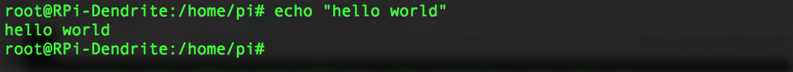
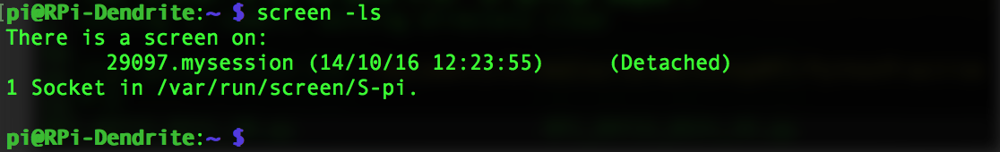

## Virtual terminal: Screen

Remember you can be connected to your RPi for up to 8 hours using **remot3.it**, after that time you have to connect again to your account and do the same access procedure we explained in the previous sections. Therefore we will show you how a *virtual terminal* can help you when you are working remotely on your RPi.

**Screen** is a full-screen software program allows you to use multiple windows (virtual VT100 terminals) in Unix. It offers a user to open several separate terminal instances inside a one single terminal window manager.

The screen application is very useful, if you are dealing with multiple programs from a command line interface and for separating programs from the terminal shell. It also allows you to share your sessions with others users and detach/attach terminal sessions.

#### When to use Screen?

One of the advantages of *Screen*, is that you can detach it. Then, you can restore it without losing anything you have done on the *Screen*. One of the typical scenario where *Screen* is of great help is when you are in the middle of SSH session and you want to download a file, update the operative, or transfer a big file to your RPi. The process could be 2 hours long. If you disconnect the SSH session, or suddenly the connection lost by accident, then the download process will stop. You have to start from the beginning again. To avoid that, we can use screen and detach it.

#### Installing Screen
Screen allows you to use multiple windows (virtual VT100 terminals) in Unix. If your local computer crashes, or you are connected remotely and lose the connection, the processes or login sessions you establish through screen don't get lost. To install Screen you can enter the following command on the RPi terminal:

```bash
sudo apt-get -y install screen
```
###### How to use Screen

* When you are in your terminal, you can create a *screen* or virtual terminal e.g. we will name the screen *mysession*:


* Then you will be automatically attached to the *mysession* screen, that from now on we will call just *screen*. You can  now execute commands and work in the terminal without worrying to loose your work:



* You can detach from the *screen* by pressing “Ctrl-A” and “d“. Once detached we will be on our RPi terminal outside any *screen* session. To check the list of *active screens*:



* We get a list with all the screen IDs. If we want to attach to a particular *screen* we can enter ```screen -r name_of_terminal``` like in the example below:


###### Basic commands to work with Screen

|Screen command| Description|
|:-------------|:-----------|
| ```screen -S name_of_terminal```    | Assigning name to the virtual terminal or screen session.|
|```screen -ls``` | List all the virtual sessions or screens opened. |
|```screen -X -S name_of_terminal quit```| Kill an specific virtual terminal.|
|```screen -r name_of_terminal```| Attach to the virtual terminal or screen.|
| Press “Ctrl-A” and “d“ | Detach from virtual terminal  or screen.|
| Press "Ctrl-A” and “K” | This command will leave and kill the virtual terminal or screen |
| Press “Ctrl-A” and “n“ | Switching to the next virtual terminal or screen.|
|Press “Ctrl-A” and “p“ | Switching to the previous virtual terminal or screen|

For additional commands check out the [Screen Cheatsheet](ScreenCheatsheet.md)
