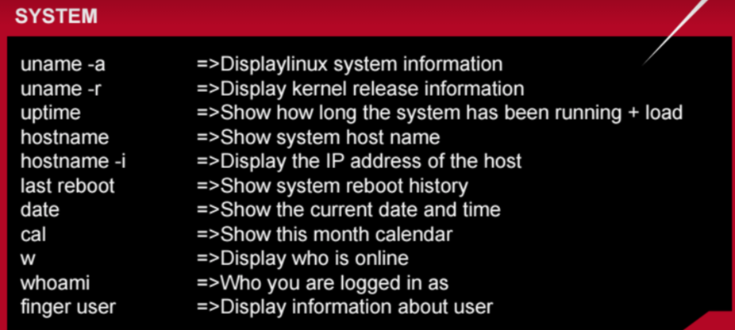

# Bash Script (Linux commands)

Here you will see a summary of the common commands use in Linux (Unix) environment. We will just give examples of the ones we will use more frequently during the workshop. This commands can't be used in Windows environment unless you use a [Linux emulator](https://www.google.co.uk/url?sa=t&rct=j&q=&esrc=s&source=web&cd=2&cad=rja&uact=8&ved=0ahUKEwi5tb-ijtPPAhWD7hoKHdyTA-IQFggmMAE&url=https%3A%2F%2Fwww.cygwin.com%2F&usg=AFQjCNHet6tpyafCXeYZCDWdFVdg2_A4IQ&sig2=jK-xBiPuohBaZkfcHhnHUw).
If you need information in the terminal about an specific Linux/Unix command you can type a command line on the terminal:

```Bash
$ man ls
```
To escape from the manual, just type: *q*

### File Commands


**Examples - working with directories:**
``` bash
$ ls
$ ls -al
$ ls -alrt
$ pwd
$ mkdir codes
$ mkdir temp temp1
$ mkdir -p temp2/ok
$ cat file.txt
$ cat file.txt file2.txt > fileOut.txt
$ rm file.txt
$ rm -r temp2/ok
$ rm -r temp2
$ df -h
```

**Note:** **rm \*** it is a dangerous command that should be use with care, you might lose all your work!!

##### Examples - Create a File:**
**Method 1:** Using nano editor:

``` bash
$ nano file.txt
```
Then you will get the screen editor where you can type in e.g. type ```echo "Hello World!"```.

To save your changes and exit the editor type:
**ctrl + x** and choose **Yes** to save your changes.
**Method 2:** Using **cat** command.
```bash
$ cat >file2.txt
"Hello Universe!"
```
To exit press: **ctrl + d"**.
### Directory


### Disk usage


### File transfer and Remote Access


### Search


### System



### Process Related


### Virtual terminal (Screen)

|Screen command| Description|
|:-------------|:-----------|
| ```screen -S name_of_terminal```    | Assigning name to the virtual terminal or screen session.|
|```screen -ls``` | List all the virtual sessions or screens opened. |
|```screen -X -S name_of_terminal quit```| Kill an specific virtual terminal.|
|```screen -r name_of_terminal```| Attach to the virtual terminal or screen.|
| Press “Ctrl-A” and “d“ | Detach from virtual terminal  or screen.|
| Press "Ctrl-A” and “K” | This command will leave and kill the virtual terminal or screen |
| Press “Ctrl-A” and “n“ | Switching to the next virtual terminal or screen.|
|Press “Ctrl-A” and “p“ | Switching to the previous virtual terminal or screen|


[Reference](https://drive.google.com/drive/u/0/folders/0B_LZEs2baSXxb0FwcXRLeGRrV2c)
