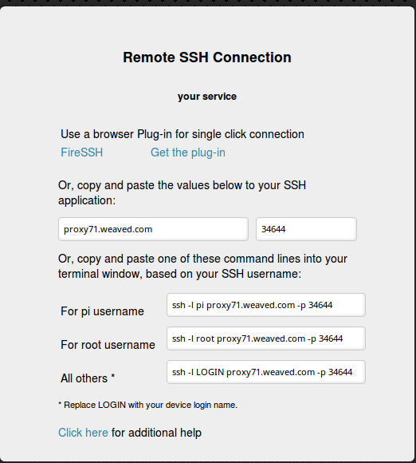

# Setting up your Raspberry Pi 3 Model B

##### Starting Set up

* Each team should get a monitor, keyboard and mouse.
* Insert the mini SD card in the Raspberry Pi , connect the mouse and keyboard in the USB ports, and the display with provided HDMI-DVI cable. Then,  using Y-cable, power it up by plugging in the charger.
* The operative system starts. Then, click on the __terminal__ icon next to the menu to open it.
* Then you need to run some commands on it as root user to configure the Raspberry Pi (RPi). The **root user** has the permission to modify files or default settings as administrator providing the root password. The **root user** is **pi** and the default **root password** is **raspberry**. First we will make stronger the password as follows:

``` bash
$ sudo raspi-config
```
* The *sudo* command presides all the linux commands when executing any other linux command as root user.

* The terminal will show a menu which can be navigated with the arrows on your keyboard and accept options with enter.


* Then we set up the keyboard to prevent any problem when changing the password, therefore we access the option: __Internationalisation Options --> Change the Keyboard Layout__. Then we choose generic 105 key, and then UK.
* Also we change the timezone in tis menu.


 * To change the password, we return to the main menu and choose the second option. We have to set the new password and do not reboot the RPi yet.

*  We check that the [ssh](https://en.wikipedia.org/wiki/Secure_Shell) for remote network communications is enabled (security shell cryptographic network protocol). We access to the __Advance Options --> SSH__.


* An optional step is to change the hostname in the same advance menu.
* Then we restart the RPi.

##### Setting WiFi from Imperial College network

* First we can use a command to check the different internet connections available on our system: _ifconfig_ or _ifconfig -a_. This command allow us also to see the IP addresses assigned to our RPi. The _wlan0_, indicates the status of the WiFi, and _eth0_ shows the status of the Ethernet (wired) connection).
* You will see there is no IP assigned to our PRI, therefore to set up the WiFi we need to modify a configuration file, but first we need to back it up:

```bash
$ sudo cp /etc/wpa_supplicant/wpa_supplicant.conf /etc/wpa_supplicant/wpa_supplicant.conf_backup
```

Then we add to the content of wpa_supplicant.conf:

```bash
# IC
network={
        ssid="Imperial-WPA"
        proto=RSN
        key_mgmt=WPA-EAP
        pairwise=CCMP
        auth_alg=OPEN
        eap=PEAP
        identity="ic\COLLEGE_USERNAME"
        password="YOUR_PASSWORD"
}
```
This is the Imperial College configuration in which you have to replace "COLLEGE_USERNAME" with a valid college username, please do not store your password in plain text, but we will change it after verifying that the WiFi is working. Reboot the system if it is necessary.

**Note:** In case the file changes after the setting it up, we need to change its permissions in order it could just be read but not overwritten: ```sudo chmod a-w /etc/wpa_supplicant/wpa_supplicant.conf```. You can see more about permission in the [link](https://en.wikipedia.org/wiki/Chmod).

In order to not store the password in a plain text we **encrypt** our password with an **MD4 hash generated** from the corresponding college password. You can generate the hash like this with the next Linux command:

```bash
$ echo -n 'YOUR_PASSWORD' | iconv -t utf16le | openssl md4 > hash.txt
$ cat hash.txt
$ (stdin)= a6c71eedc2eacbca84003336a4a62a1c
```

Then we copy the string : a6c71eedc2eacbca84003336a4a62a1c, and open
the wpa_supplicant.conf.

```bash
$ nano /etc/wpa_supplicant/wpa_supplicant.conf
```

The default text editor installed in the RPi is _nano_. We can install also _vim_ or _vi_ to have another text editor option.

In the line where with your "YOUR_PASSWORD" we replaced with the string we generated as hexadecimal characters, and we add the 'hash:'-prefix), e.g.

```bash
# IC
network={
        ssid="Imperial-WPA"
        proto=RSN
        key_mgmt=WPA-EAP
        pairwise=CCMP
        auth_alg=OPEN
        eap=PEAP
        identity="ic\COLLEGE_USERNAME"
        password=hash:a6c71eedc2eacbca84003336a4a62a1c
}
```
A last security step to do is to remove the bash history, with all the commands we had typed on the terminal. Therefore, we do it like:
```bash
$ history -w
$ history -c
```
Then we reboot again the RPi to check that the password was properly set up.

##### Installing Python

To install Linux packages in our system we must use the command: ```sudo apt-get install name_of_package```.

**Installing C lib needed by Python:**
```bash
sudo apt-get -y install libffi-dev
sudo apt-get -y install libssl-dev
```
**Installing Python:**

```bash
sudo apt-get -y install build-essential python-dev python-openssl
sudo apt-get -y install python-setuptools
sudo apt-get -y remove --purge python-pip
sudo apt-get -y install python-pip
sudo pip install --upgrade pip
```
**Installing other text editor:**
```bash
sudo apt-get -y install vim
```

**Installing screen:**
The screen program allows you to use multiple windows (virtual VT100 terminals) in Unix. If your local computer crashes, or you are connected remotely and lose the connection, the processes or login sessions you establish through screen don't get lost.

```bash
sudo apt-get -y install screen
```

**Installing weaved:**
Manage network devices remotely using [weaved](http://www.weaved.com/) service. To install:
```bash
sudo apt-get -y install weavedconnectd
```
To configure weaved in our RPi, first we need to open an account in [weaved](http://www.weaved.com/). Then, we have to link the device to our weaved account:
```bash
sudo weavedinstaller
```
Follow the instructions. Then we can access using our laptop or any other desktop from any terminal. We will get a list of the devices linked to weaved:


Then we click to one of the devices:


Then we copy the command to our laptop or desktop terminal to access to our RPi terminal:
```bash
ssh -l pi proxy71.weaved.com -p 34644
```
The weaved service is free and the duration of the connection is 30 min long. If we need to work longer, once we are connected we can execute:

```bash
ifconfig
```
This one will give us the IP address. Then, we can login to the RPi as:
```bash
ssh pi@192.31.123.122
```
